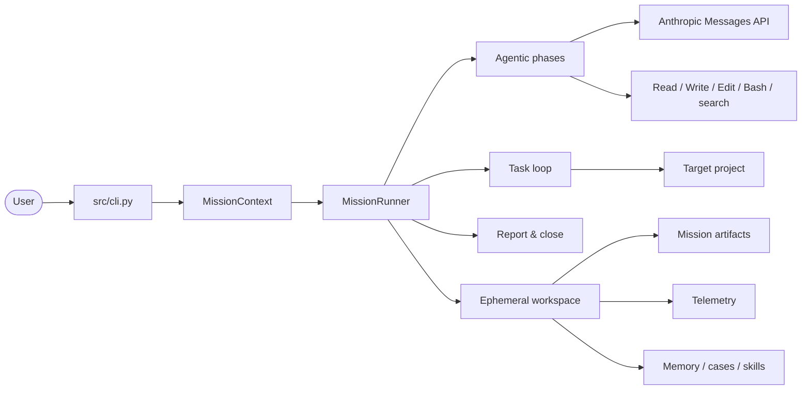

# HERO

**HERO** stands for **H**arness for **E**ngineering and **R**un-time **O**rchestration.

> A runtime **control system** around foundation models for autonomous software-engineering missions.

[](LICENSE)
[](https://www.python.org/downloads/)
[](https://github.com/mikelval82/hero-harness/actions/workflows/ci.yml)
[](CONTRIBUTING.md)

HERO is **not** a single agent. It is a control system that wraps a large
language model and turns it into a reliable software engineer: it prepares context,
routes models per phase, executes work through tools, validates artifacts, recovers
from failures, records traces, and keeps reusable learning across missions.

The design is grounded in recent research on **harness engineering** — the idea that
autonomous software capability is an emergent property of the
`model × harness × environment` system, not of the model alone. See
[`docs/research/`](docs/research/) for the literature review behind this project.

---

## Table of contents

- [Why a harness?](#why-a-harness)
- [Key features](#key-features)
- [Architecture](#architecture)
- [Mission modes](#mission-modes)
- [Quickstart](#quickstart)
- [The Tron Arena benchmark](#the-tron-arena-benchmark)
- [Repository layout](#repository-layout)
- [Methodology & research](#methodology--research)
- [Contributing](#contributing)
- [License](#license)

---

## Why a harness?

A raw LLM call is stateless and unaccountable. A *harness* adds the scaffolding that
makes autonomous engineering possible and auditable:

$$
C_{\text{system}} = F(C_{\text{model}},\; C_{\text{harness}},\; C_{\text{environment}},\; T)
$$

This project implements that scaffolding as a **multi-phase mission pipeline** driven by
specialised sub-agents (`researcher → specifier → planner → implementer → reviewer`),
with telemetry, memory, a static code graph, and gated artifacts at every step.

## Key features

- **Phase-based mission pipeline** — research, spec, plan, implement and review run as
  discrete, auditable phases with their own prompts and quality gates.
- **Model routing per phase** — cheaper models for exploration, stronger models for
  implementation (`src/core/model_policy.py`).
- **Agentic runtime** — a tool-using loop (`Read / Write / Edit / Bash / search`) over the
  Anthropic Messages API (`src/agent/loop.py`).
- **Code knowledge graph** — tree-sitter static analysis to give agents structure-aware
  context (`src/analysis/`).
- **Persistent learning** — case base, project memory and a skill library that survive
  across missions (`src/harness/`).
- **Ephemeral workspace** — all mission artifacts are written to an isolated harness
  workspace; the target project only receives the requested code changes.
- **Tron Arena benchmark** — a deterministic game engine to benchmark agent strategies
  ([`benchmark/tron_arena/`](benchmark/tron_arena/)).

## Architecture



A full set of architecture and flow diagrams lives in
[`harness-diagram.md`](harness-diagram.md).

## Mission modes

Every mission is organised as `setup → init → task loop → finalize`. The `--mode` flag
decides which phases run in each block:

| Mode | Init pipeline | Task pipeline | Finalize | Use |
|---|---|---|---|---|
| `full` | `research → structure` | by complexity S/M/L | report + merge | Default end-to-end route |
| `focused` | `research → structure` | by complexity S/M/L | report + merge | Less upfront conversation |
| `hotfix` | none | by complexity S/M/L | report + merge | Reuse existing `tasks.json` |
| `explore` | `research` | none | report | Research only |
| `spec` | `research → structure` | `spec` | report | Partial harness, spec only |
| `spec-plan` | `research → structure` | `spec → plan` | report | Partial harness, spec + plan |

## Quickstart

### Requirements

- Python **3.12+**
- An Anthropic API key

### Install

```bash
git clone https://github.com/mikelval82/hero-harness.git
cd hero-harness
python -m venv .venv
# Windows: .venv\Scripts\activate
# Unix:    source .venv/bin/activate
pip install -r requirements.txt
```

### Configure

Copy the example environment file and add your credentials:

```bash
cp .env.example .env
```

```dotenv
ANTHROPIC_API_KEY=sk-ant-...
# Optional integrations
# TELEGRAM_TOKEN=
# TELEGRAM_CHAT_ID=
```

### Run a mission

```bash
# Explore a codebase (research only, no code changes)
python src/cli.py "Audit the authentication module" --mode explore

# Full autonomous mission on a feature
python src/cli.py "Add pagination to the products endpoint" --mode full
```

Mission artifacts are written to an isolated workspace (`$CLAUDE_HARNESS`); your target
project only receives the requested code changes.

## The Tron Arena benchmark

A deterministic two-player Tron engine for benchmarking bot strategies, used to measure
the harness against baseline policies.

```bash
# Single match between two built-in bots
python -m benchmark.tron_arena match --bot-a greedy_space --bot-b random_legal --seed 42

# Round-robin tournament
python -m benchmark.tron_arena tournament \
  --bots random_legal,straight_until_blocked,greedy_space,always_left \
  --seeds 1,2,3
```

See [`benchmark/tron_arena/README.md`](benchmark/tron_arena/README.md) for the full CLI.

## Repository layout

```
hero-harness/
├── src/                 # Harness engine (mission orchestration, agent loop, memory)
│   ├── cli.py           # Entry point
│   ├── agent/           # Tool-using agentic loop
│   ├── core/            # Context, model routing, git, paths
│   ├── mission/         # Mission runner, phase runner, reporting
│   ├── harness/         # Telemetry, case base, project memory, skills
│   ├── analysis/        # tree-sitter code graph
│   └── tests/           # Unit tests
├── agents/              # Sub-agent definitions (researcher, planner, ...)
├── prompts/             # Phase prompt templates
├── benchmark/           # Tron Arena benchmark
├── docs/research/       # Literature review (harness-engineering papers)
├── AGENTS.md            # Methodology map
├── CHECKPOINTS.md       # Universal quality criteria
├── CONTEXT.md           # Shared methodology vocabulary
└── harness-diagram.md   # Architecture & flow diagrams
```

## Methodology & research

- [`AGENTS.md`](AGENTS.md) — the methodology map and agent registry.
- [`CONTEXT.md`](CONTEXT.md) — shared vocabulary of the methodology.
- [`CHECKPOINTS.md`](CHECKPOINTS.md) — universal quality criteria.
- [`docs/research/`](docs/research/) — summaries of the academic work this harness builds on
  (AI Harness Engineering, Reflexion, Voyager, DSPy, TextGrad, and more).

## Contributing

Contributions are welcome! Please read [CONTRIBUTING.md](CONTRIBUTING.md) for the workflow,
coding conventions and how to run the test suite.

## License

Distributed under the MIT License. See [LICENSE](LICENSE) for details.

---

<p align="center">
  If this project is useful to you, consider giving it a ⭐ — it helps others find it.
</p>
