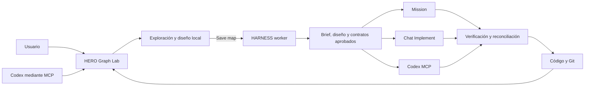

# Mission Orchestrator v2

Mission Orchestrator es el núcleo de ejecución de HERO: convierte una intención
revisada en una misión trazable, gobierna sus contratos y decide si la
implementación puede completarse. Su interfaz visual complementaria es
[HERO Graph Lab](https://github.com/mikelval82/hero-graph-lab), donde una persona
puede explorar el código, diseñar cambios, aprobar gates y observar el estado de
la misión.

Los dos repositorios permanecen desacoplados. HARNESS puede ejecutar misiones
desde CLI, stdin o Telegram sin Graph Lab; Graph Lab puede explorar código y
preparar un borrador de diseño sin HARNESS. Cuando trabajan juntos, Graph Lab
arranca `mission-worker` como un proceso independiente y se comunica únicamente
mediante HTTP/JSON autenticado en loopback. Graph Lab no importa el código de
HARNESS y el token del worker nunca se entrega al navegador.

## Relación con HERO Graph Lab

Graph Lab es el editor y visualizador; HARNESS es la autoridad contractual. Un
cambio dibujado en Graph Lab sigue siendo un borrador local hasta que el usuario
elige **Save map**. A partir de ahí, HARNESS conserva las revisiones aprobadas,
compila el ChangeSet y el WorkPlan, publica contratos de tarea inmutables,
concede el único lease de ejecución y verifica el resultado contra el código.


```mermaid
flowchart LR
    User[Usuario] --> GraphLab[HERO Graph Lab]
    Codex[Codex mediante MCP] --> GraphLab
    GraphLab --> Draft[Exploración y diseño local]
    Draft -->|Save map| Worker[HARNESS worker]
    Worker --> Contract[Brief, diseño y contratos aprobados]
    Contract --> Mission[Mission]
    Contract --> Chat[Chat Implement]
    Contract --> MCP[Codex MCP]
    Mission --> Verify[Verificación y reconciliación]
    Chat --> Verify
    MCP --> Verify
    Verify --> Project[Código y Git]
    Project --> GraphLab
```

Mission, el chat de Graph Lab y Codex mediante MCP consumen el mismo contrato de
tarea, pero no pueden modificar simultáneamente una misión. HARNESS registra el
actor `mission`, `chat` o `mcp` en un único lease. Una vez cerrado, el verificador
común determina si los nodos y relaciones contractuales están materializados o
siguen siendo divergentes; Graph Lab solo representa visualmente ese estado
derivado.

## Estado

Este repositorio contiene una base funcional con:

- Dominio y puertos puros.
- `AppServices` como composition root sin framework DI.
- Pipeline por modos `full`, `focused`, `plan`, `explore` y `hotfix`.
- Adapters filesystem para artefactos, tareas, estado, workspace y registry.
- Tools `Read`, `Write`, `Edit`, `Glob`, `Grep` y `Bash` con politica de rutas.
- CommandBus unico con listeners stdin/Telegram.
- Gate evaluator, HITL basico, compactacion, report y Git service.
- Code graph SQLite incremental basado en `ast` de Python.
- Control plane local versionado con snapshots, documentos, mapa de diseno y eventos.
- Worker HTTP autenticado para clientes independientes como Graph Lab.
- Snapshots aprobados, ChangeSets, WorkPlans y contratos de tarea inmutables.
- Lease de ejecución compartido por Mission, Chat y MCP.
- Verificador estructural Python, reconciliación y receipts de ejecución.
- Tests sin depender de Anthropic o Telegram reales ni de repositorios Git externos.

## Uso

```powershell
.\.venv\Scripts\python.exe -m mission_orchestrator.cli "Implement foo" feature/foo --mode plan
```

Para usar el script `mission`, instala el paquete en editable:

```powershell
uv pip install -e .
```

Los adapters Anthropic y DeepSeek son opcionales. Instala uno con
`uv pip install -e ".[anthropic]"` o `uv pip install -e ".[deepseek]"`. Anthropic
usa `ANTHROPIC_API_KEY`; DeepSeek usa `DEEPSEEK_API_KEY` y, de forma opcional,
`DEEPSEEK_BASE_URL`. HARNESS carga `.env` y `.env.local` sin sobrescribir
variables ya definidas.

El proveedor puede seleccionarse con `--provider` o `HARNESS_PROVIDER`; el
modelo, con `--model` o `HARNESS_MODEL`. DeepSeek usa `deepseek-v4-flash` por defecto:

```powershell
.\.venv\Scripts\python.exe -m mission_orchestrator.cli "Implement foo" feature/foo `
    --provider deepseek --model deepseek-v4-flash
```

## Ejecutar HARNESS con Graph Lab

Prepara primero el entorno virtual de este repositorio. Después inicia Graph Lab
desde su propio checkout, indicando el proyecto que ambos procesos compartirán,
la raíz de HARNESS y su intérprete:

```powershell
cd C:\path\to\hero-graph-lab
.\.venv\Scripts\python.exe -m hero_graph_lab `
	--mission-project C:\path\to\project `
	--harness-root C:\path\to\hero-harness `
	--harness-python C:\path\to\hero-harness\.venv\Scripts\python.exe
```

Graph Lab queda disponible por defecto en <http://127.0.0.1:8765>. Al pulsar
**Start mission**, el host de Graph Lab crea el worker, lee su único handshake
por stdout y conserva el token exclusivamente en el proceso servidor. Las
peticiones del navegador se envían al proxy local de Graph Lab, no directamente
al puerto autenticado del worker.

## Worker y API local

`mission-worker` es el limite de integracion para interfaces externas. Escucha
solo en loopback, imprime un unico handshake JSON al arrancar y exige el token
de ese handshake en el resto de peticiones. El Host que crea el proceso debe
mantener el token fuera del navegador.

```powershell
.\.venv\Scripts\python.exe -m mission_orchestrator.worker `
	--project C:\ruta\proyecto `
	--task "Implementar la mision" `
	--branch feature/mision `
	--mode full
```

El contrato se publica en `/api/v1/openapi.json`; las capacidades negociables,
en `/api/v1/capabilities`. Snapshots, documentos y operaciones de diseno usan
revisiones para detectar escrituras obsoletas.

El worker es la API que consume Graph Lab para mostrar snapshots, documentos,
eventos, diseño, gates y contratos sin compartir memoria ni imports. Graph Lab
negocia las operaciones disponibles mediante `/api/v1/capabilities`; no asume
que todas las versiones de HARNESS ofrecen los mismos comandos.

## Ejecución dirigida por contratos

Una idea o un brief maduro entra como semilla, no como aprobación automática.
Research y Grill lo convierten en el `brief.md` revisado. La aprobación conjunta
de ese brief y una revisión de diseño produce un snapshot inmutable que fija el
proyecto, el commit base, el grafo observado y las obligaciones deseadas. De ese
snapshot se derivan el ChangeSet, el WorkPlan y una porción contractual exacta
para cada tarea.

Cada tarea pasa por SPEC y PLAN antes de IMPLEMENT, y todas las fases reciben la
misma porción contractual. Mission usa directamente el servicio de contratos.
Graph Lab Chat solo puede escribir después de activar explícitamente
**Implement** y utiliza lecturas y parches limitados a rutas contractuales, con
SHA-256 y compare-and-swap. Codex obtiene el contrato y gobierna su lifecycle a
través del MCP de Graph Lab, pero conserva sus herramientas nativas contenidas
para editar y ejecutar pruebas; MCP no introduce otro shell ni otro almacén.

Un ejecutor debe terminar completando, informando un bloqueo o solicitando una
enmienda. HARNESS vuelve a ejecutar la validación configurada y el verificador
estructural antes de aceptar la finalización. Un cambio de diseño durante la
ejecución se detiene en el siguiente límite seguro y exige una nueva aprobación.
Al terminar la misión, HARNESS versiona `mission-report.md`; solo hace commit o
merge si la verificación y la reconciliación final abren el gate correspondiente.

## Tests

```powershell
.\.venv\Scripts\python.exe -m unittest discover -s tests
```
