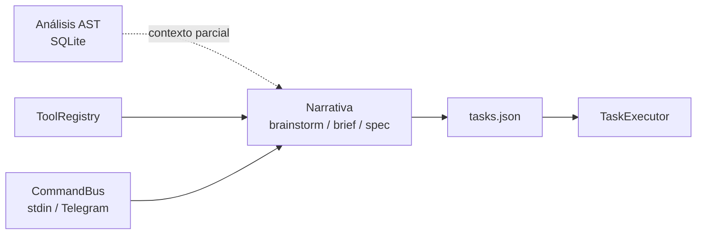
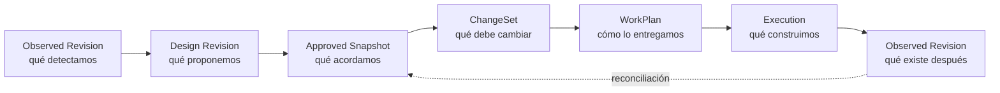
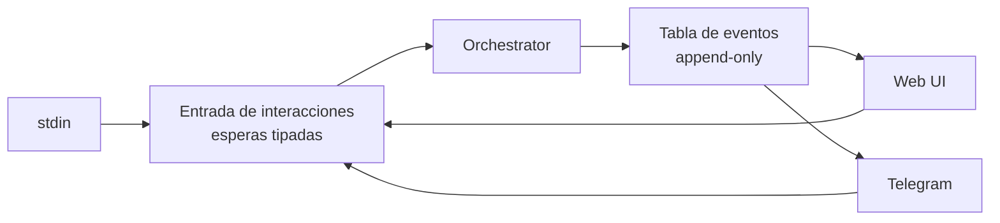
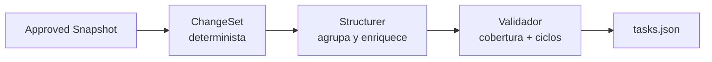
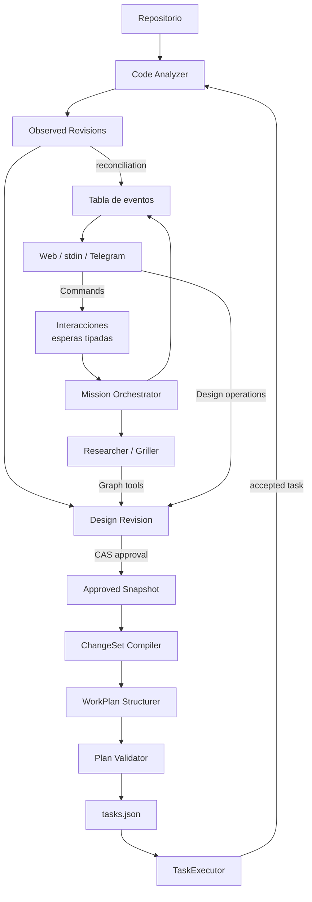

# HERO v2: el pizarrón vivo

Documento de visión y diseño para evolucionar Mission Orchestrator hacia una forma de trabajo donde el diseño de software se discute, aprueba y ejecuta sobre un mapa compartido del sistema.

---

## 1. La idea

Hoy, la arquitectura de una misión se negocia principalmente mediante texto. El humano expresa una intención, los agentes investigan, hacen preguntas y producen documentos, y otro agente convierte esos documentos en tareas. El proceso funciona, pero el acuerdo arquitectónico queda repartido entre conversaciones y artefactos narrativos. Antes de ejecutar resulta difícil responder con precisión qué parte del sistema existe, qué parte se propone cambiar y si el plan final cubre exactamente lo que se aprobó.

HERO v2 introduce un objeto compartido en el centro de esa conversación: un **mapa vivo del sistema**. El humano y los agentes dejan de describirse mutuamente una arquitectura que cada uno reconstruye en su cabeza y pasan a observar y modificar una representación común.

La analogía es una mesa de arquitectura. El plano no sustituye la conversación, pero le da un lugar concreto. El arquitecto puede explicar por qué propone una ampliación; el cliente puede señalar una pared y pedir que no se toque; el constructor puede derivar del plano una orden de trabajo. La conversación conserva el razonamiento, mientras el plano conserva la estructura y el acuerdo.

```text
        MODELO ACTUAL                         MODELO PROPUESTO

    Humano ──texto──▶ Agente                    ┌──────────────┐
      ▲                  │                      │  MAPA VIVO   │
      └──────texto───────┘                      └──▲────────▲──┘
                                                   │        │
                                                Humano    Agentes

    El acuerdo se reconstruye                  El acuerdo tiene una
    desde varios documentos.                   revisión visible y aprobable.
```

La experiencia buscada tiene tres propiedades. El mapa permite cambiar de escala sin mostrar a la vez servicios, paquetes y funciones. Distingue visualmente lo observado en el repositorio de lo propuesto por una persona o un agente. Y, cuando una revisión se aprueba, la convierte en una descripción verificable del cambio que después se transforma en un plan ejecutable.

El mapa no pretende eliminar el lenguaje natural ni convertir toda decisión de ingeniería en matemáticas. El grafo expresa estructura, relaciones e intención; los documentos siguen explicando restricciones, motivos, riesgos y criterios de aceptación. HERO mejora cuando ambos formatos colaboran, no cuando uno intenta reemplazar al otro.

---

## 2. El punto de partida real

El proyecto ya contiene buena parte de la infraestructura sobre la que construir esta evolución.

El adaptador de análisis recorre código Python con `ast` y almacena en SQLite módulos, clases, funciones, métodos y relaciones sintácticas. El escaneo es incremental por fichero. Actualmente se ejecuta cuando hay una fase inicial y antes de procesar cualquier tarea no completada; una reanudación, un hotfix sin fases iniciales o el final de la última tarea pueden dejar ventanas sin una observación reciente. Es una base útil, pero todavía no es un catálogo semántico completo: una llamada se registra por su nombre textual, sin resolver necesariamente su identidad, y el descubrimiento actual necesita tratar correctamente ficheros nuevos, borrados y renombrados.

El `ToolRegistry` ya permite dar capacidades especializadas a cada fase. Esto ofrece un punto de integración natural para que `researcher` y `griller` consulten y propongan cambios sobre el mapa sin manipular SQLite ni JSON directamente.

El `CommandBus` ya recibe órdenes de stdin y Telegram, y el cliente del agente puede esperar una respuesta humana durante una conversación. Sin embargo, el bus actual es una cola de consumidor único, no un canal de publicación para múltiples vistas. Tampoco existe un flujo de salida que publique a una interfaz los mensajes del agente y los cambios de estado. La web puede reutilizar el lenguaje de comandos, pero necesita enrutado y eventos explícitos.

Finalmente, `tasks.json`, `TaskExecutor` y los pipelines por complejidad ya constituyen un bucle de ejecución funcional. La nueva propuesta debe ampliarlo, no crear un segundo ejecutor paralelo.



La oportunidad no consiste en reemplazar estas piezas. Consiste en insertar entre la observación del código y la ejecución una secuencia explícita de revisiones que hoy queda implícita en los documentos.

---

## 3. El modelo mental: del territorio a la obra

El sistema no tendrá un único “grafo verdadero”. Tendrá artefactos con responsabilidades diferentes y relaciones explícitas entre ellos.



La **Observed Revision** es una fotografía derivada del repositorio en un commit o estado de trabajo concreto. Se puede regenerar y cada relación conserva su grado de resolución. No es una opinión ni una intención.

La **Design Revision** es el pizarrón editable. Contiene elementos aportados por el análisis, el humano y los agentes. Es una propuesta mutable con identidad y número de revisión.

El **Approved Snapshot** es una copia inmutable de una revisión de diseño concreta. Aprobar significa fijar exactamente esa revisión, no simplemente pulsar un botón mientras el mapa continúa cambiando.

El **ChangeSet** es la diferencia estructurada entre la observación de partida y el snapshot aprobado. Describe operaciones atómicas como crear un componente, modificar una relación o retirar una integración. Todavía no es un plan de tareas.

El **WorkPlan** agrupa esas operaciones en unidades entregables, establece dependencias de ejecución y añade criterios de verificación. Esta separación evita asumir que cada caja del mapa equivale a una tarea.

La **Execution** utiliza el bucle existente. Tras cada tarea aprobada se crea una nueva revisión observada y se compara con el snapshot para mostrar progreso y deriva.

La analogía completa es la de un catastro y una reforma. La revisión observada es el levantamiento del edificio actual. La revisión de diseño es el papel vegetal sobre el que se dibujan alternativas. El snapshot aprobado es el plano sellado. El change-set es el cómputo de actuaciones. El work plan es la organización de los gremios. La nueva revisión observada es la inspección de lo realmente construido.

---

## 4. Cómo se representa sin mezclar conceptos

Una sola etiqueta como `EXISTING`, `PROPOSED` o `MODIFIED` mezcla preguntas diferentes. Un servicio externo puede existir aunque no tenga símbolo AST. Un nodo puede estar observado y, al mismo tiempo, propuesto para retirada. Mover una caja en el lienzo no significa modificar el código. Por eso el modelo conserva dimensiones separadas.

| Dimensión | Pregunta que responde | Ejemplos |
| --- | --- | --- |
| Procedencia | ¿Quién o qué introdujo el elemento? | `ANALYZER`, `HUMAN`, `AGENT` |
| Ubicación | ¿Dónde vive el elemento? | `IN_REPOSITORY`, `EXTERNAL` |
| Resolución | ¿Qué evidencia tenemos sobre su identidad? | `RESOLVED`, `AMBIGUOUS`, `UNRESOLVED` |
| Intención | ¿Qué quiere hacer la revisión de diseño? | `KEEP`, `CREATE`, `CHANGE`, `REMOVE` |

La aprobación pertenece a la revisión completa, no a cada elemento. Una revisión es borrador hasta que se fija como snapshot aprobado; las alternativas descartadas permanecen en el historial de operaciones, pero no forman parte de ese snapshot.

La interfaz calcula el estilo visual a partir de estas dimensiones. Un elemento `IN_REPOSITORY + RESOLVED + KEEP` puede aparecer sólido y neutro. Un elemento `IN_REPOSITORY + UNRESOLVED + CREATE` puede aparecer punteado y resaltado. Un elemento `RESOLVED + REMOVE` puede mostrarse tachado. Un servicio `EXTERNAL + RESOLVED` puede representarse como existente sin exigir un símbolo AST. La apariencia es una proyección, no una verdad almacenada en un campo ambiguo.

Los nodos de diseño tienen una identidad lógica independiente y pueden conservar **localizadores esperados** aunque todavía no resuelvan. Por ejemplo, una clase propuesta puede esperar una declaración de tipo `class`, con nombre cualificado `RedisCache`, en `src/cache/redis.py`. Tras la ejecución, el analizador intenta resolver ese localizador. Si lo consigue, la UI enlaza la identidad lógica con la declaración observada sin perder su historia.

Las declaraciones observadas necesitan identificadores no ambiguos dentro de cada revisión, construidos al menos con ruta normalizada, tipo de símbolo y nombre léxico completamente cualificado. Las funciones y clases anidadas no pueden compartir el identificador de su contenedor inmediato. Como una ruta o un nombre pueden cambiar, el identificador observado sigue perteneciendo a una revisión concreta; la continuidad entre revisiones se obtiene mediante reconciliación y evidencia, no suponiendo que una cadena `fichero:símbolo` sea una identidad eterna.

Una ancla no resuelta no significa automáticamente “propuesta”. También puede indicar un símbolo renombrado, un fichero eliminado o una limitación del analizador. La intención y la resolución deben permanecer separadas para que HERO pueda distinguir progreso de deriva.

---

## 5. Qué puede afirmar el analizador

El nivel de confianza del mapa debe ser visible. Un AST demuestra que existe una declaración sintáctica, pero no siempre identifica con certeza el destino de una llamada. HERO no debe presentar ambos casos con la misma autoridad.

Las relaciones observadas se clasifican como `RESOLVED`, `AMBIGUOUS` o `UNRESOLVED`. Solo las relaciones resueltas pueden usarse automáticamente para anclar elementos o imponer restricciones al plan. Las ambiguas y no resueltas siguen siendo útiles para búsqueda y contexto, pero la UI las dibuja de otra forma y los agentes conocen su incertidumbre.

La primera iteración aplica este principio recortando el alcance, no graduando todo. Solo ingiere en el lienzo los hechos que el AST garantiza sin resolución semántica: declaraciones de módulos, clases y funciones, imports y contención por directorios. Todo lo que entra es `RESOLVED` por construcción. El grafo de llamadas queda fuera del lienzo en v1, porque resolver la identidad del destino de una llamada en Python es un problema abierto y el mapa arquitectónico necesita sobre todo estructura, no flujo de invocaciones. La clasificación graduada existe en el modelo desde el principio, pero solo empieza a poblarse cuando se incorporen fuentes menos fiables.

El zoom también distingue evidencia de autoría. El nivel de código procede del AST. El nivel de paquete se deriva conservadoramente del árbol de directorios. El nivel de sistema, los límites de dominio y las dependencias externas son diseño aportado por humanos o agentes. Un agente puede sugerirlos, pero conserva su procedencia y no se presenta como descubrimiento verificado.

```text
    NIVEL        FUENTE PRINCIPAL                  AUTORIDAD

    Sistema      humano o propuesta de agente      diseño explícito
    Paquete      árbol de directorios               estructura derivada
    Código       AST + resolución de símbolos       evidencia graduada
```

El extractor debe además diferenciar relaciones útiles para la arquitectura del ruido de referencias léxicas. Las referencias pueden conservarse para búsqueda, pero no deben enviarse por defecto al lienzo. El descubrimiento debe incluir ficheros relevantes nuevos, purgar elementos de ficheros borrados y producir cada revisión observada de forma transaccional.

---

## 6. Persistencia y ámbito de vida

Guardar todos los datos en la base de una misión actual no hace durable el mapa: ese directorio puede eliminarse al comenzar de nuevo. La persistencia debe seguir la vida real de cada artefacto.

La caché de observación pertenece a un repositorio y una revisión de Git. Es regenerable y puede vivir en el espacio de trabajo de la misión o en una caché compartida identificada por commit.

El baseline arquitectónico pertenece al proyecto. Sobrevive entre misiones y representa el último snapshot aceptado como referencia. No se elimina al reiniciar una misión. El `project_id` se deriva de la ruta absoluta normalizada del repositorio, lo que distingue dos repositorios con el mismo nombre sin necesidad de un registro con migraciones. El nombre sanitizado de la carpeta se conserva solo para presentación. Un registro de proyectos completo es una evolución posterior, justificable si aparecen cachés compartidas entre máquinas o repositorios que cambian de ruta con frecuencia; la clave derivada de la ruta no impide esa migración.

La propuesta editable pertenece a una misión. Puede descartarse sin alterar el baseline, pero debe poder reanudarse incluso antes de que exista `tasks.json`. La existencia de un manifiesto de misión, y no la de las tareas, determina si hay estado recuperable.

El snapshot aprobado pertenece simultáneamente a la misión que lo produjo y al historial del proyecto. Es inmutable, tiene identidad propia y registra las revisiones observada y de diseño que aprobó.

SQLite puede seguir siendo el almacenamiento operativo. Un fichero JSON no debe ser la fuente mutable principal, pero sí puede ser un formato útil de exportación, inspección o versionado de snapshots aprobados. “Una base de datos” es una decisión de despliegue; la consistencia procede de las identidades, revisiones y transacciones, no de guardar todo físicamente junto.

---

## 7. Cómo colaboran humano y agentes

Los agentes no escriben SQL ni sustituyen el mapa completo. Reciben herramientas de dominio para consultar una revisión y proponer operaciones validadas. Una herramienta de consulta permite navegar por nivel, padre, procedencia, resolución e intención. Una herramienta de mutación acepta un lote con un `operation_id` idempotente y la revisión de diseño global sobre la que se calculó el lote. Cuando el bloqueo por entidad deje de estar diferido, esa precondición podrá afinarse a la revisión esperada de cada entidad afectada sin cambiar el contrato de la herramienta.

El estado materializado del diseño permanece en tablas normales. Un registro de operaciones conserva autor, momento, precondiciones y resultado para auditoría. Este MVP no necesita event sourcing completo. El deshacer no es un cimiento de la primera versión: el historial de operaciones deja la puerta abierta a implementarlo después mediante operaciones compensatorias, sin asumir que toda operación pueda invertirse gratuitamente.

Sobre la concurrencia conviene decir en voz alta algo que el flujo real del harness ya cumple: el humano y el agente **no escriben simultáneamente**. El agente muta el mapa durante su turno de fase; el humano interviene sobre todo cuando el agente está bloqueado esperando una respuesta o una aprobación. La colaboración es por turnos, no concurrente. Elevar esa observación a regla explícita —el lienzo acepta ediciones humanas cuando el agente no está en medio de un turno de escritura— permite que la primera versión use una única revisión global de diseño como control optimista. El bloqueo por entidad, que permitiría ediciones simultáneas sobre nodos distintos, queda diferido; el modelo de datos no lo impide, simplemente no se paga hasta que el modo por turnos demuestre quedarse corto.

La interacción humana necesita dos caminos distintos.



El problema que hay que resolver en la entrada es que una aprobación de arquitectura no pueda ser consumida por una espera de revisión de tarea. La versión mínima de esa garantía son **esperas tipadas**: cada punto de bloqueo declara qué clase de interacción acepta y devuelve al bus lo que no le corresponde. Un `CommandRouter` general con `interaction_id` y correlación completa es la evolución natural si las fuentes y los consumidores se multiplican, pero con tres fuentes y un consumidor secuencial las esperas tipadas compran la misma corrección con una fracción del mecanismo.

La salida es un `MissionEventStream` conceptual cuya implementación mínima es una tabla de eventos *append-only* en el almacenamiento de la misión, que cualquier vista lee por polling con un cursor. Publica mensajes del agente, cambios de fase, solicitudes de interacción, revisiones del mapa y resultados. No hace falta un componente pub/sub: la semántica de "eventos ordenados que se leen desde una posición" la da una tabla con autoincremento. La UI es un adaptador periférico, pero para ser una conversación completa necesita tanto entrada de comandos como salida de eventos.

El puerto del cliente de agente debe evolucionar para producir eventos incrementales o aceptar un `EventSink`. El adaptador publica el texto del agente y la solicitud de respuesta **antes** de bloquearse esperando al humano; el `PhaseResult` final continúa cerrando la fase y acumulando métricas. No basta con emitir el resultado al terminar, porque entonces la UI no podría mostrar la pregunta que debe responder. Esta evolución pertenece al anillo de la interfaz, no al kernel: mientras la interacción sea por stdin o Telegram, el flujo actual ya muestra la pregunta por sus propios medios.

Si la web no está disponible, stdin y Telegram siguen pudiendo resolver las mismas interacciones. El núcleo no depende del navegador.

---

## 8. De una revisión aprobada a un plan ejecutable

La aprobación utiliza compare-and-swap sobre la revisión esperada. Si el usuario intenta aprobar la revisión 42 y el mapa ya está en la 43, HERO rechaza la acción y muestra el nuevo cambio. Si coincide, crea un snapshot inmutable y el compilador trabaja exclusivamente sobre él.

La compilación ocurre en dos pasos.

Primero, un componente determinista produce el `ChangeSet`. Cada operación del change-set referencia elementos observados y de diseño, conserva su intención y expresa precondiciones. El resultado puede incluir trabajo sobre nodos y sobre relaciones.

Después se construye el `WorkPlan`. Las operaciones se agrupan en entregables coherentes. Las dependencias arquitectónicas sirven como contexto, pero no se convierten mecánicamente en dependencias de ejecución: una relación `CALLS` no dice por sí sola qué tarea debe ejecutarse primero. El structurer puede proponer agrupación, complejidad y criterios de aceptación, pero un validador determinista exige que toda operación del change-set esté cubierta exactamente una vez y que las dependencias del plan sean válidas.



`Task` se amplía con dependencias, operaciones cubiertas y nodos objetivo. Su estado incorpora `BLOCKED` con la causa y las dependencias que lo bloquean. `TaskExecutor` ejecuta tareas disponibles, persiste ese estado cuando falla una dependencia y conserva el comportamiento de reanudación. Al reintentar o corregir una dependencia, los bloqueos derivados se recalculan de forma determinista y pueden volver a `PENDING`. Si existe un ciclo, se muestra para corrección o se agrupa explícitamente como una unidad atómica; no se rompe en silencio.

La consolidación actual basada en modelo no se aplica después de compilar un plan, porque podría perder cobertura o dependencias. Si el plan excede el máximo, vuelve al paso de agrupación y debe superar de nuevo el validador.

---

## 9. Mantener el mapa honesto durante la ejecución

El proyecto ya reconstruye el grafo antes de cada tarea pendiente. HERO v2 añade una reconstrucción después de aprobar cada tarea y antes del informe final, de modo que la observación incluya siempre el último resultado aceptado.

Cada reconstrucción produce una nueva `Observed Revision`. La reconciliación compara esa revisión con las anclas y operaciones del snapshot aprobado. Una operación puede aparecer como pendiente, materializada, divergente o no verificable. La ausencia de resolución no se interpreta automáticamente como fallo.

Un cursor que solo cuente operaciones de diseño no basta para sincronizar la UI, porque los hechos, el estado de misión y la conversación cambian sin producir operaciones de diseño. La tabla de eventos de la sección 7 resuelve esto sin multiplicar canales: cada reconstrucción del grafo observado, cambio de fase o mensaje del agente publica su propio evento en el mismo log, de modo que un único cursor sobre ese log capta todo lo que cambia. El snapshot inicial declara además las revisiones vigentes de `observed`, `design`, `mission_state` y `conversation`, para que una vista pueda resincronizarse desde cualquier punto sin releer el historial completo.

La deriva no es simplemente “todo nodo que sigue propuesto”. Es una diferencia explicable entre lo aprobado y lo observado: un elemento esperado que no apareció, uno observado en una ubicación distinta, una relación que no pudo verificarse o código nuevo fuera del change-set. El informe conserva esas categorías para que el humano decida si acepta la implementación, corrige el mapa o crea trabajo adicional.

Antes del commit y merge final existe un **gate de reconciliación**. Un resultado parcial, operaciones aprobadas sin cubrir o divergencias críticas impiden el merge automático aunque la misión no tenga un bloqueo técnico global. Las discrepancias no críticas pueden aceptarse explícitamente y quedan registradas contra el snapshot. Esto requiere que la política de merge evalúe el resultado y la reconciliación, no únicamente la ausencia de `BlockReason`.

---

## 10. La interfaz y el transporte

La primera interfaz debe validar la experiencia, no fijar prematuramente una plataforma. El servidor escucha solo en `127.0.0.1`, utiliza un token por sesión, valida el origen y aplica la política de rutas cuando una operación puede terminar apuntando al filesystem.

Para el MVP, las mutaciones pueden viajar por HTTP y las actualizaciones mediante long polling o un flujo unidireccional de eventos. La elección debe probarse con mensajes del agente y revisiones del mapa, no decidirse solo por latencia. WebSocket queda como opción si más adelante se necesita verdadera comunicación bidireccional persistente.

La UI empieza en modo lectura: snapshot, zoom, evidencia, intención, historial y conversación. Después añade edición manual. Un prototipo ligero puede validar el contrato sin una cadena de frontend compleja, pero el lienzo editable no debe convertirse en infraestructura artesanal por principio. Si selección, conexiones, accesibilidad, layout y undo crecen, se adoptará una librería de grafos madura como dependencia opcional del adaptador web.

La interfaz consume contratos públicos del núcleo. No lee tablas SQLite directamente y no decide cómo se compilan las tareas.

---

## 11. Arquitectura propuesta



Los puertos nuevos expresan capacidades, no tecnologías: repositorio de revisiones observadas, repositorio de diseño, compilador de change-set, entrada de interacciones tipadas y publicador de eventos de misión. El router general con correlación completa y un pub/sub real son evoluciones posibles de esos dos últimos puertos, no sus primeras implementaciones. SQLite, HTTP y la UI son adaptadores reemplazables. La flecha de operaciones de diseño desde el humano corresponde al anillo de edición manual; en el kernel, la intervención humana llega por comandos y conversación.

---

## 12. Estrategia de implementación: el kernel primero

Una secuencia por capas horizontales —primero toda la evidencia, luego todo el diseño, luego toda la planificación— acumula infraestructura cuya utilidad depende de una hipótesis que solo se prueba al final. La estrategia correcta es la contraria: un **corte vertical estrecho** que atraviese la cadena completa cuanto antes, y anillos de mejora alrededor de lo que demuestre valer.

El kernel construye una versión estrecha de cada eslabón, de punta a punta y sin interfaz gráfica. El grafo observado se limita a los hechos estructurales fiables descritos en la sección 5, con descubrimiento y purga de ficheros corregidos y revisiones transaccionales. La capa de diseño incorpora las cuatro dimensiones, los localizadores esperados y las dos herramientas de agente, operando en modo por turnos con revisión global. La aprobación usa CAS y produce el snapshot inmutable. El compilador determinista genera el `ChangeSet`, el structurer agrupa, el validador exige cobertura exacta y dependencias válidas, y `tasks.json` se amplía con dependencias y estado `BLOCKED`. Un render textual del diff y la aprobación por stdin o Telegram cierran el circuito humano. La reconciliación tras cada tarea y el gate mínimo de merge cierran el circuito con la realidad.

Ese kernel es falsable por sí solo: permite medir si los planes trazables al mapa superan a los actuales antes de haber escrito una línea de frontend, y ninguna de sus piezas se tira si la respuesta obliga a ajustar el modelo.

Los anillos posteriores añaden, por este orden y solo si el kernel sostiene la hipótesis: la emisión incremental del puerto del agente y la tabla de eventos; la UI de lectura con zoom, conversación e historial; la edición manual desde el lienzo con los gestos como operaciones normales; y por último los mecanismos diferidos que la escala reclame —bloqueo por entidad, deshacer compensatorio, router general de interacciones, registro de proyectos, resolución graduada de llamadas y librería visual madura—. Cada uno de esos mecanismos tiene su hueco reservado en el modelo de datos; diferirlos no es descartarlos, es negarse a pagarlos antes de necesitarlos.

Cada anillo conserva un modo headless. La ausencia de navegador nunca impide investigar, aprobar ni ejecutar una misión.

---

## 13. Límites de esta iteración

El flujo de mapa es **opcional por modo de misión**. Los modos `full` y `plan` lo incorporan de forma natural; `hotfix` y los cambios pequeños en `focused` no deben pagar el peaje de dibujar y aprobar un mapa para tocar tres líneas. La peor muerte posible de esta característica sería convertirse en burocracia: si mantener el mapa cuesta más que el cambio que describe, el usuario dejará de mantenerlo y volveremos al punto de partida con más código que mantener.

HERO v2 no promete que el grafo comprenda toda la semántica del código. Hace visible qué relaciones están resueltas y cuáles son aproximaciones, y en la primera versión directamente excluye del lienzo las que no puede resolver.

No convierte automáticamente cada elemento arquitectónico en una tarea. El change-set fija cobertura y el work plan define unidades entregables.

No usa un fichero JSON mutable como fuente operativa, aunque permite exportar snapshots para inspección o versionado.

No adopta event sourcing completo, WebSocket, una biblioteca de grafos en memoria ni análisis multilenguaje como requisitos iniciales. Son opciones posteriores sujetas a necesidades demostradas.

No presenta inferencias del agente como hechos. Las sugerencias son valiosas precisamente porque conservan su procedencia y requieren aprobación.

---

## 14. Cómo sabremos si funciona

La hipótesis principal es que un plan trazable a una revisión visual aprobada produce implementaciones más alineadas que un plan generado únicamente desde narrativa.

La evaluación registra el primer veredicto de revisión, reintentos, operaciones del change-set no cubiertas, cambios humanos al plan, tareas bloqueadas por dependencias, deriva tras la ejecución, conflictos de edición, tiempo hasta aprobación y coste de tokens. “Retrabajo” significa una nueva ejecución causada por revisión, deriva o corrección humana, y no cualquier conversación adicional.

El coste de tokens merece atención propia, porque decide la viabilidad económica de la característica. Sustituir volcados de markdown por consultas de herramienta puede abaratar el contexto o encarecerlo con rondas adicionales de tool-use, y no se sabe cuál de las dos cosas ocurrirá sin medirlo. El logging actual de tokens por fase ya permite comparar misiones con y sin herramientas de grafo desde el primer día del kernel.

Para obtener esas medidas se añade telemetría estructurada, pero solo la que la hipótesis necesita: veredicto inicial, retrabajo, cobertura del change-set y deriva, correlacionadas por misión, snapshot y tarea. La instrumentación acompaña al kernel y no se pospone hasta la evaluación —el logger actual de fases, tiempo y tokens no puede reconstruir por sí solo cobertura ni intervención humana—, pero tampoco se adelanta: los identificadores de correlación adicionales se incorporan cuando el anillo que los usa exista.

La comparación debe mantener constantes, en lo posible, modelo, prompts y dificultad. Una evaluación emparejada sobre las mismas misiones ofrece evidencia más fuerte, aunque cuesta más; una comparación histórica puede servir para orientar, pero no para atribuir causalidad.

El criterio de avance hacia el lienzo editable no es únicamente una mejora en la tasa de aprobación. También debe comprobarse que el mapa reduce ambigüedad para el humano, que la trazabilidad permite explicar de dónde salió cada tarea y que mantener el diseño vivo no añade más fricción que la que elimina.

El resultado buscado no es un diagrama más atractivo. Es un ciclo en el que HERO puede responder, en cualquier momento, qué observó, qué se propuso, qué se aprobó, qué se decidió ejecutar y qué terminó existiendo.