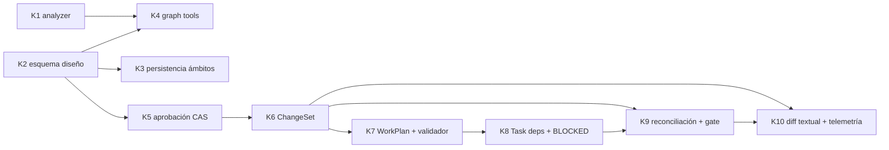

# HERO v2 — Kernel: estructura de trabajo y auditoría

Cuaderno de trabajo de la implementación del kernel descrito en [hero-v2-grafo-vivo.md](../hero-v2-grafo-vivo.md) (sección 12). Registra el backlog, las decisiones de diseño críticas tomadas durante cada tarea y el protocolo de commits que permite revertir cualquier paso.

Referencia de visión: [docs/hero-v2-grafo-vivo.md](../hero-v2-grafo-vivo.md) — congelada como contrato de intención. Las specs se auditan contra ella; el código se audita contra las specs y sus tests.

---

## 0. Acceso al repositorio y protocolo de commits

Verificado el 2026-08-04:

| Ítem | Estado |
| --- | --- |
| Repo local | `C:\Users\MikelValCalvo\HARNESS`, rama `develop` |
| Remoto | `origin = https://github.com/mikelval82/hero-harness.git` (cuenta personal) |
| Cuenta `gh` activa | `mikelval82` (cambiada desde `mikelvc-inditex` con `gh auth switch`) |
| Identidad de commits | Local del repo: `Mikel Val Calvo <mikelval82@gmail.com>` (la global Inditex queda intacta) |
| Firma GPG | Desactivada **solo en este repo** (`git config commit.gpgsign false`): la clave global es de Inditex y no está disponible |
| `safe.directory` | Añadida excepción global para este path (el `.git` fue creado por otro usuario local) |
| Baseline | `e28c9b8` — código v2 completo + documento de visión, suite verde (11 tests) |
| Ramas remotas previas | `main` y `hardening/p0-runtime-boundaries` contienen la implementación v1; **no se tocan**. `develop` es la línea de trabajo v2 |

Protocolo por tarea:

1. Cada tarea Kn se implementa completa y se cierra con **un commit** `Kn: <resumen>` sobre `develop`, con la suite entera en verde.
2. Si una tarea necesita un paso intermedio arriesgado, se permite un commit `Kn(wip): <paso>` adicional, pero el cierre siempre deja verde.
3. Push a `origin/develop` tras cada cierre de tarea. Rollback = `git revert <commit>` (nunca reset sobre lo publicado).
4. Este documento se actualiza **en el mismo commit** que cierra la tarea: decisiones tomadas, desviaciones de la spec y veredicto de auditoría.

---

## 1. Backlog del kernel

Grafo de dependencias (las tareas son un DAG, igual que el formato que la propia feature defiende):

| ID | Tarea | Spec | Estado | Commit |
|----|-------|------|--------|--------|
| K1 | Analyzer: descubrimiento tracked+untracked, purga de borrados, revisiones observadas transaccionales, solo hechos estructurales en el lienzo, IDs cualificados por ámbito léxico | ligera | ✅ hecho | `K1` |
| K2 | Esquema capa de diseño: dimensiones (procedencia/ubicación/resolución/intención), localizadores esperados, log de operaciones, revisión global, versión de esquema | **completa** | pendiente | — |
| K3 | Persistencia por ámbitos: `project_id` por ruta normalizada, baseline de proyecto que sobrevive misiones, manifiesto de misión (reanudable sin `tasks.json`) | ligera | pendiente | — |
| K4 | Herramientas `GraphQuery`/`GraphPropose`, registro en fases research/grill, prompts de agentes actualizados | **completa** | pendiente | — |
| K5 | Aprobación CAS sobre revisión de diseño + Approved Snapshot inmutable + espera tipada por stdin/Telegram | ligera | pendiente | — |
| K6 | Compilador `ChangeSet` (función pura: snapshot + observación de partida → operaciones) | **completa** | pendiente | — |
| K7 | Structurer agrupa a WorkPlan + validador determinista de cobertura y ciclos + desactivar consolidación LLM para planes compilados | **completa** | pendiente | — |
| K8 | `Task.dependencies` + `target_nodes` + estado `blocked` + scheduling en `TaskExecutor` | ligera | pendiente | — |
| K9 | Reconciliación tras tarea aceptada + categorías de deriva + gate de merge | **completa** | pendiente | — |
| K10 | Render textual del diff + telemetría mínima (veredicto inicial, retrabajo, cobertura, deriva) | ligera | pendiente | — |

Reglas de proceso acordadas en fase de debate:

- Specs de dos pesos: **completa** (contrato + casos borde + tabla de aceptación) solo donde vive la ambigüedad; **ligera** (media página: qué cambia, qué no, cómo se verifica) para lo mecánico.
- Los tests son la spec ejecutable: las tareas con spec completa entregan primero su tabla de aceptación como tests en rojo.
- La auditoría comprueba dos hechos: el diff no excede el alcance de la spec, y los tests de aceptación no se modificaron para pasar.
- **Checkpoint de hito tras K7**: misión real headless de prueba antes de construir K9–K10. Si el plan compilado no supera al actual, se corrige K2/K6 antes de seguir.
- Sin dependencias nuevas de runtime. Tests con `unittest` stdlib, sin red, sin Anthropic real.

Las specs completas viven en `docs/hero-v2/specs/Kn-<nombre>.md` y se crean justo antes de su tarea, no todas por adelantado.

---

## 2. Registro de decisiones de diseño

Cada entrada se escribe al cerrar la tarea, en su mismo commit. Formato: contexto → decisión → alternativas descartadas → consecuencias.

### K0 — Preparación del repositorio (2026-08-04)

**D-0.1 · La v2 no reescribe la historia de `main`.** El remoto contiene la implementación v1 (182 ficheros que el árbol local elimina). Se descartó hacer push forzado a `main` o borrar las ramas v1: `develop` lleva la v2 como línea paralela y la sustitución de `main` será una decisión humana explícita al final, no un efecto colateral del setup.

**D-0.2 · Configuración de identidad por ámbito, no global.** Identidad personal y desactivación de GPG se aplican con `git config` local al repo. La estación de trabajo sigue siendo de Inditex y su configuración global (`mikelvc@ext.inditex.com`, firma con clave corporativa) no debe cambiar. Consecuencia: cualquier clon nuevo de este repo en esta máquina necesitará repetir esos dos comandos.

**D-0.3 · Baseline único antes de empezar.** Todo el árbol v2 preexistente entra en un solo commit (`e28c9b8`) en lugar de trocearlo retroactivamente por módulos. La historia útil empieza a partir del kernel; trocear el pasado sería arqueología sin valor de rollback.

### K1 — Analyzer (2026-08-04)

**D-1.1 · Separación física estructural/léxico, no un flag.** Las relaciones `defines/imports/inherits` viven en `edges`; `calls/references` (nombres textuales sin resolver) se mueven a `lexical_refs`. Se descartó una columna `structural` sobre la tabla única: la separación física hace imposible que una consulta de lienzo arrastre ruido por olvidar el filtro, y el lienzo de K4 consultará solo `edges`. `dependencies/dependents` siguen uniendo ambas para no romper el CLI.

**D-1.2 · IDs por qualname léxico completo.** `fichero:Outer.Inner.method` con pila de ámbitos, en lugar de `fichero:Clase.nombre` con solo el padre inmediato. Elimina las colisiones de anidados homónimos que detectó la revisión (dos `helper` en ámbitos distintos). El tipo `method` se decide por el ámbito inmediato (`class`), no por "hay alguna clase en la pila": una función anidada dentro de un método es `function`.

**D-1.3 · Versionado destructivo del esquema.** `PRAGMA user_version`; si no coincide, se dropean las tablas y se recrean. Se descartó migración incremental: la capa de hechos es derivada y regenerable por diseño, reconstruir es más barato y más seguro que migrar. Esto NO aplicará a las tablas de diseño de K2, que son autorales y necesitarán migración real.

**D-1.4 · Revisión observada como contador en `meta`, bump solo si hubo cambios.** Un build sin cambios no crea revisión nueva, para que la reconciliación de K9 pueda usar "¿cambió la revisión?" como señal barata. Se descartó una tabla de revisiones con snapshot completo por revisión: el kernel no la necesita.

**D-1.5 · Descubrimiento `git ls-files --cached --others --exclude-standard`.** Incluye untracked respetando `.gitignore`, y se filtran paths listados que ya no existen (borrado sin indexar); `stat()` fallido se salta en lugar de romper el build. Fallback a `rglob` fuera de un repo git, como antes.

**D-1.6 · Bug preexistente corregido: `dead_code` era imposible.** La consulta original hacía `LEFT JOIN edges ON target = n.id` buscando nodos sin aristas entrantes, pero todo nodo definido tiene una arista `defines` entrante, así que nunca devolvía nada. Ahora busca por `name` en `lexical_refs` (usos reales) y excepción para `inherits`. Sigue siendo heurístico (nombres textuales), coherente con su propósito de búsqueda.

**D-1.7 · Bug latente corregido: conexiones SQLite sin cerrar.** `with connect()` en sqlite3 hace commit pero no cierra; en Windows deja el fichero bloqueado (lo expusieron los tempdirs de los tests). Nuevo `session()` contextmanager con commit+close garantizados, usado en todas las rutas.

_(pendiente)_ → nada pendiente de K1.

### K2 — Esquema de la capa de diseño

_(pendiente)_

### K3 — Persistencia por ámbitos

_(pendiente)_

### K4 — Herramientas de grafo

_(pendiente)_

### K5 — Aprobación CAS y snapshot

_(pendiente)_

### K6 — Compilador ChangeSet

_(pendiente)_

### K7 — WorkPlan y validador

_(pendiente)_

### K8 — Scheduling con dependencias

_(pendiente)_

### K9 — Reconciliación y gate de merge

_(pendiente)_

### K10 — Diff textual y telemetría

_(pendiente)_

---

## 3. Auditoría por tarea

Se rellena al cierre. Una fila por tarea: qué prometía la spec, qué verifica la suite, desviaciones aceptadas.

| Tarea | Tests de aceptación | Suite total | Desviaciones de la spec | Veredicto |
|-------|--------------------|-------------|--------------------------|-----------|
| K0 | n/a (setup) | 11/11 verde | n/a | ✅ baseline publicado |
| K1 | 7/7 (tests/adapters/test_code_graph.py): untracked, purga, qualnames, separación, revisión, dead-code, versión esquema | 18/18 verde | Dos correcciones fuera de alcance nominal, aceptadas por ser bugs (D-1.6, D-1.7); GRAPH_INSTRUCTIONS actualizado al esquema nuevo | ✅ |
| K2 | — | — | — | — |
| K3 | — | — | — | — |
| K4 | — | — | — | — |
| K5 | — | — | — | — |
| K6 | — | — | — | — |
| K7 | — | — | — | — |
| K8 | — | — | — | — |
| K9 | — | — | — | — |
| K10 | — | — | — | — |
