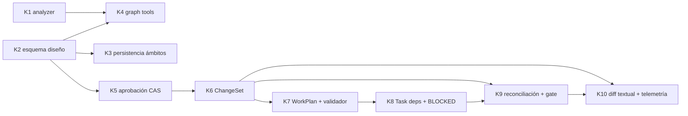

# HERO v2 — Kernel: estructura de trabajo y auditoría

Cuaderno de trabajo de la implementación del kernel descrito en [hero-v2-grafo-vivo.md](../hero-v2-grafo-vivo.md) (sección 12). Registra el backlog, las decisiones de diseño críticas tomadas durante cada tarea y el protocolo de commits que permite revertir cualquier paso.

Referencia de visión: [docs/hero-v2-grafo-vivo.md](../hero-v2-grafo-vivo.md) — congelada como contrato de intención. Las specs se auditan contra ella; el código se audita contra las specs y sus tests.

---

## 0. Acceso al repositorio y protocolo de commits

Verificado el 2026-08-04:

| Ítem | Estado |
| --- | --- |
| Repo local | `C:\Users\MikelValCalvo\HARNESS`, rama `develop` |
| Remoto | `origin = https://github.com/mikelval82/hero-harness.git` (cuenta personal) |
| Cuenta `gh` activa | `mikelval82` (cambiada desde `mikelvc-inditex` con `gh auth switch`) |
| Identidad de commits | Local del repo: `Mikel Val Calvo <mikelval82@gmail.com>` (la global Inditex queda intacta) |
| Firma GPG | Desactivada **solo en este repo** (`git config commit.gpgsign false`): la clave global es de Inditex y no está disponible |
| `safe.directory` | Añadida excepción global para este path (el `.git` fue creado por otro usuario local) |
| Baseline | `e28c9b8` — código v2 completo + documento de visión, suite verde (11 tests) |
| Ramas remotas previas | `main` y `hardening/p0-runtime-boundaries` contienen la implementación v1; **no se tocan**. `develop` es la línea de trabajo v2 |

Protocolo por tarea:

1. Cada tarea Kn se implementa completa y se cierra con **un commit** `Kn: <resumen>` sobre `develop`, con la suite entera en verde.
2. Si una tarea necesita un paso intermedio arriesgado, se permite un commit `Kn(wip): <paso>` adicional, pero el cierre siempre deja verde.
3. Push a `origin/develop` tras cada cierre de tarea. Rollback = `git revert <commit>` (nunca reset sobre lo publicado).
4. Este documento se actualiza **en el mismo commit** que cierra la tarea: decisiones tomadas, desviaciones de la spec y veredicto de auditoría.

---

## 1. Backlog del kernel

Grafo de dependencias (las tareas son un DAG, igual que el formato que la propia feature defiende):

| ID | Tarea | Spec | Estado | Commit |
|----|-------|------|--------|--------|
| K1 | Analyzer: descubrimiento tracked+untracked, purga de borrados, revisiones observadas transaccionales, solo hechos estructurales en el lienzo, IDs cualificados por ámbito léxico | ligera | ✅ hecho | `K1` |
| K2 | Esquema capa de diseño: dimensiones (procedencia/ubicación/resolución/intención), localizadores esperados, log de operaciones, revisión global, versión de esquema | **completa** | ✅ hecho | `K2` |
| K3 | Persistencia por ámbitos: `project_id` por ruta normalizada, baseline de proyecto que sobrevive misiones, manifiesto de misión (reanudable sin `tasks.json`) | ligera | ✅ hecho | `K3` |
| K4 | Herramientas `GraphQuery`/`GraphPropose`, registro en fases research/grill, prompts de agentes actualizados | **completa** | ✅ hecho | `K4` |
| K5 | Aprobación CAS sobre revisión de diseño + Approved Snapshot inmutable + espera tipada por stdin/Telegram | ligera | ✅ hecho | `K5` |
| K6 | Compilador `ChangeSet` (función pura: snapshot + observación de partida → operaciones) | **completa** | ✅ hecho | `K6` |
| K7 | Structurer agrupa a WorkPlan + validador determinista de cobertura y ciclos + desactivar consolidación LLM para planes compilados | **completa** | ✅ hecho | `K7` |
| K8 | `Task.dependencies` + `target_nodes` + estado `blocked` + scheduling en `TaskExecutor` | ligera | ✅ hecho | `K8` |
| K9 | Reconciliación tras tarea aceptada + categorías de deriva + gate de merge | **completa** | ✅ hecho | `K9` |
| K10 | Render textual del diff + telemetría mínima (veredicto inicial, retrabajo, cobertura, deriva) | ligera | ✅ hecho | `K10` |

Reglas de proceso acordadas en fase de debate:

- Specs de dos pesos: **completa** (contrato + casos borde + tabla de aceptación) solo donde vive la ambigüedad; **ligera** (media página: qué cambia, qué no, cómo se verifica) para lo mecánico.
- Los tests son la spec ejecutable: las tareas con spec completa entregan primero su tabla de aceptación como tests en rojo.
- La auditoría comprueba dos hechos: el diff no excede el alcance de la spec, y los tests de aceptación no se modificaron para pasar.
- **Checkpoint de hito tras K7**: misión real headless de prueba antes de construir K9–K10. Si el plan compilado no supera al actual, se corrige K2/K6 antes de seguir.
- Sin dependencias nuevas de runtime. Tests con `unittest` stdlib, sin red, sin Anthropic real.

Las specs completas viven en `docs/hero-v2/specs/Kn-<nombre>.md` y se crean justo antes de su tarea, no todas por adelantado.

---

## 2. Registro de decisiones de diseño

Cada entrada se escribe al cerrar la tarea, en su mismo commit. Formato: contexto → decisión → alternativas descartadas → consecuencias.

### K0 — Preparación del repositorio (2026-08-04)

**D-0.1 · La v2 no reescribe la historia de `main`.** El remoto contiene la implementación v1 (182 ficheros que el árbol local elimina). Se descartó hacer push forzado a `main` o borrar las ramas v1: `develop` lleva la v2 como línea paralela y la sustitución de `main` será una decisión humana explícita al final, no un efecto colateral del setup.

**D-0.2 · Configuración de identidad por ámbito, no global.** Identidad personal y desactivación de GPG se aplican con `git config` local al repo. La estación de trabajo sigue siendo de Inditex y su configuración global (`mikelvc@ext.inditex.com`, firma con clave corporativa) no debe cambiar. Consecuencia: cualquier clon nuevo de este repo en esta máquina necesitará repetir esos dos comandos.

**D-0.3 · Baseline único antes de empezar.** Todo el árbol v2 preexistente entra en un solo commit (`e28c9b8`) en lugar de trocearlo retroactivamente por módulos. La historia útil empieza a partir del kernel; trocear el pasado sería arqueología sin valor de rollback.

### K1 — Analyzer (2026-08-04)

**D-1.1 · Separación física estructural/léxico, no un flag.** Las relaciones `defines/imports/inherits` viven en `edges`; `calls/references` (nombres textuales sin resolver) se mueven a `lexical_refs`. Se descartó una columna `structural` sobre la tabla única: la separación física hace imposible que una consulta de lienzo arrastre ruido por olvidar el filtro, y el lienzo de K4 consultará solo `edges`. `dependencies/dependents` siguen uniendo ambas para no romper el CLI.

**D-1.2 · IDs por qualname léxico completo.** `fichero:Outer.Inner.method` con pila de ámbitos, en lugar de `fichero:Clase.nombre` con solo el padre inmediato. Elimina las colisiones de anidados homónimos que detectó la revisión (dos `helper` en ámbitos distintos). El tipo `method` se decide por el ámbito inmediato (`class`), no por "hay alguna clase en la pila": una función anidada dentro de un método es `function`.

**D-1.3 · Versionado destructivo del esquema.** `PRAGMA user_version`; si no coincide, se dropean las tablas y se recrean. Se descartó migración incremental: la capa de hechos es derivada y regenerable por diseño, reconstruir es más barato y más seguro que migrar. Esto NO aplicará a las tablas de diseño de K2, que son autorales y necesitarán migración real.

**D-1.4 · Revisión observada como contador en `meta`, bump solo si hubo cambios.** Un build sin cambios no crea revisión nueva, para que la reconciliación de K9 pueda usar "¿cambió la revisión?" como señal barata. Se descartó una tabla de revisiones con snapshot completo por revisión: el kernel no la necesita.

**D-1.5 · Descubrimiento `git ls-files --cached --others --exclude-standard`.** Incluye untracked respetando `.gitignore`, y se filtran paths listados que ya no existen (borrado sin indexar); `stat()` fallido se salta en lugar de romper el build. Fallback a `rglob` fuera de un repo git, como antes.

**D-1.6 · Bug preexistente corregido: `dead_code` era imposible.** La consulta original hacía `LEFT JOIN edges ON target = n.id` buscando nodos sin aristas entrantes, pero todo nodo definido tiene una arista `defines` entrante, así que nunca devolvía nada. Ahora busca por `name` en `lexical_refs` (usos reales) y excepción para `inherits`. Sigue siendo heurístico (nombres textuales), coherente con su propósito de búsqueda.

**D-1.7 · Bug latente corregido: conexiones SQLite sin cerrar.** `with connect()` en sqlite3 hace commit pero no cierra; en Windows deja el fichero bloqueado (lo expusieron los tempdirs de los tests). Nuevo `session()` contextmanager con commit+close garantizados, usado en todas las rutas.

_(pendiente)_ → nada pendiente de K1.

### K2 — Esquema de la capa de diseño (2026-08-04)

Spec: [specs/K2-design-layer.md](specs/K2-design-layer.md). Tests A1–A9 escritos antes que la implementación.

**D-2.1 · Base de datos separada (`design.db`), no tablas junto a los hechos.** La migración de hechos es destructiva por diseño (D-1.3); poner datos autorales en el mismo fichero habría dejado la pérdida de diseño a un cambio de `SCHEMA_VERSION` de distancia. Separar ficheros convierte la política en estructura: el diseño falla con `DesignStoreVersionError` ante versión desconocida y nunca dropea.

**D-2.2 · La resolución no es una columna.** `resolution_for(node, facts)` calcula RESOLVED/UNRESOLVED resolviendo el `locator` contra los hechos en el momento de la consulta; EXTERNAL se deriva de la dimensión `location`. Almacenarla habría creado el estado desincronizable que el documento de visión prohíbe. `AMBIGUOUS` existe en el enum pero nada lo produce aún (llegará con fuentes menos fiables, según lo diferido).

**D-2.3 · CAS global + rechazo registrado, sin excepciones de control de flujo hacia fuera.** `apply()` devuelve siempre `ApplyResult` (APPLIED/CONFLICT/REJECTED/DUPLICATE) y registra **todos** los intentos en `operations`, incluidos los fallidos —la auditoría de quién intentó qué es tan valiosa como el estado final. Los conflictos no son errores del programa, son resultados del protocolo.

**D-2.4 · Atomicidad con SAVEPOINT dentro de la transacción de sesión.** El lote se valida aplicándolo: si una operación falla, rollback al savepoint y se registra el rechazo en la misma transacción. Se descartó validar-primero-aplicar-después porque duplicaría la lógica de efectos del propio lote (una arista puede apuntar a un nodo creado dos operaciones antes).

**D-2.5 · `provenance` inmutable; `remove_node` con limpieza determinista.** Quién introdujo un elemento es un hecho histórico, no un campo editable. Borrar un nodo elimina sus aristas y desengancha (`parent_id = NULL`) a sus hijos en vez de borrarlos en cascada: borrar un contenedor no debe destruir silenciosamente el trabajo que contenía.

**D-2.6 · Sin puerto todavía.** `DesignStore` es un adapter usado por otros adapters (las tools de K4); el protocolo en `ports/` se introducirá cuando el core de aplicación lo consuma (K5, aprobación). Crear la abstracción antes de su segundo consumidor sería especular.

### K3 — Persistencia por ámbitos (2026-08-04)

Spec: [specs/K3-persistence-scopes.md](specs/K3-persistence-scopes.md).

**D-3.1 · `project_id` = sha256 truncado de la ruta absoluta normalizada (lowercase, separadores unificados).** Diez caracteres bastan para el propósito (distinguir repos homónimos en una máquina); la carpeta es `{nombre}-{id}` para conservar legibilidad humana. Consecuencia asumida: mover el repo de carpeta cambia el id y “abandona” el estado anterior —aceptable en kernel, y es exactamente el caso que el registro de proyectos diferido resolvería si algún día duele.

**D-3.2 · Dos ámbitos bajo la clave de proyecto: `missions/<branch>` y `project/`.** El setup de misión solo borra dentro de `missions/`; `project/` (donde K5 pondrá el baseline y los snapshots aprobados) es intocable para el ciclo de vida de misiones. La separación es de nuevo estructural, no una convención: el `rmtree` apunta a un subárbol que no contiene el ámbito durable.

**D-3.3 · La reanudabilidad la decide `_mission.json`, no `tasks.json`.** Una misión interrumpida durante research o grill —que es cuando el mapa de diseño se está construyendo— ya no pierde su estado al reanudar. El manifiesto se escribe solo en arranques frescos, preservando el timestamp original en las reanudaciones.

**D-3.4 · Los workspaces del layout antiguo no se migran.** Quedan huérfanos en `~/.harness/<nombre>/`; eran efimeros por definición (el layout viejo los borraba en cada arranque sin resume). Migrarlos sería código para preservar datos diseñados para no sobrevivir.

### K4 — Herramientas de grafo (2026-08-04)

Spec: [specs/K4-graph-tools.md](specs/K4-graph-tools.md). Tests B1–B8 escritos antes que la implementación.

**D-4.1 · Toda respuesta lleva `design_revision`.** El protocolo CAS de K2 exige que el agente conozca la revisión vigente para proponer; incluirla en cada salida (query y propose, incluso en CONFLICT) elimina una ronda extra de tool-use por turno —directamente relevante para la métrica de coste en tokens de la sección 14 de la visión.

**D-4.2 · El canal impone el autor.** `GraphPropose` firma siempre las operaciones como `AGENT` en el log de auditoría; el agente no puede suplantar a HUMAN. La dimensión `provenance` de cada nodo sí queda a su criterio, porque el griller transcribe decisiones humanas del chat —distinción deliberada entre *quién ejecutó la operación* y *de quién es la idea*.

**D-4.3 · CONFLICT/REJECTED son salida JSON normal, no excepción.** El agente debe leer el resultado y reintentar razonadamente; una excepción de tool acabaría como texto de error opaco en el tool_result. En CONFLICT se devuelve la revisión actual para reconstruir el lote sin query adicional.

**D-4.4 · `GraphQuery` cubre design y facts.** El agente ancla propuestas buscando declaraciones reales (`scope='facts'`, patrón → id/tipo/fichero) sin necesidad de Bash ni SQL —la revisión de K0 había detectado que `bash_policy` bloquea `sqlite3`, así que el párrafo GRAPH_INSTRUCTIONS era en la práctica inoperante para consultas; estas tools son el reemplazo real.

**D-4.5 · Solo RESEARCH y GRILL reciben las tools (`DESIGN_TOOLS`).** SPEC/PLAN/IMPLEMENT no dibujan en el kernel; ampliar el acceso será una decisión explícita cuando haya evidencia de que lo necesitan (B7 lo verifica en negativo).

**D-4.6 · Los prompts declaran el contrato conversacional.** researcher: mapa (estructura) + brainstorm (razonamiento), SYSTEM siempre como diseño y nunca como hecho. griller: consulta el mapa antes de preguntar, refleja decisiones humanas al momento, y regla de coherencia —no registrar en brief.md nada que el mapa contradiga.

### K5 — Aprobación CAS y snapshot (2026-08-04)

Spec: [specs/K5-approval.md](specs/K5-approval.md).

**D-5.1 · `snapshot_id` por hash del contenido canónico, no por timestamp.** Aprobar dos veces el mismo estado produce el mismo id (verificado en test): la identidad del acuerdo es su contenido. El timestamp va dentro del snapshot pero fuera del hash. Esto hace los snapshots deduplicables y verificables a posteriori.

**D-5.2 · Migración aditiva dentro de la versión soportada.** La tabla `approvals` se añade ejecutando el `CREATE TABLE IF NOT EXISTS` idempotente tambén cuando `user_version` ya es la soportada. Bumpear la versión habría invalidado design.db recién creados por un cambio puramente aditivo; la política de fallo-sin-drop se mantiene intacta para versiones desconocidas.

**D-5.3 · Ante CONFLICT en el approve, el coordinador re-presenta, no falla.** Si el mapa cambió mientras el humano decída (turno del agente terminado tarde), la reacción correcta es notificar y volver a esperar sobre la nueva revisión —exactamente el comportamiento CAS que la visión §8 describe.

**D-5.4 · Doble export: misión + ámbito durable.** `approved_snapshot.json` en el workspace (input directo del compilador K6) y `snapshots/<id>.json` en `project/` (historial que sobrevive misiones, K3). JSON como formato de exportación de snapshots es exactamente el rol que la visión §6 le reserva.

**D-5.5 · Coordinador con inyección directa, sin tocar `AppServices` aún.** La integración en el pipeline (dónde se invoca la espera dentro del flujo de misión) pertenece a K6/K7, cuando la compilación sustituya a la generación libre de tasks.json; añadir el puerto ahora sería plumbing especulativo (coherente con D-2.6).

### K6 — Compilador ChangeSet (2026-08-04)

Spec: [specs/K6-changeset-compiler.md](specs/K6-changeset-compiler.md). Tests C1–C8 escritos antes que la implementación.

**D-6.1 · Función pura en el dominio, sin conexiones.** `compile_changeset(snapshot, observed_ids)` recibe el dict del snapshot y un `set` de ids observados; quien llama resuelve la observación. Cero IO hace el determinismo trivialmente verificable (C6 compara serializaciones byte a byte con órdenes de entrada distintos).

**D-6.2 · CREATE ya materializado se omite con motivo, no falla.** Si el locator de un CREATE ya resuelve, la propuesta se cumplió (típicamente en reanudaciones o recompilaciones); generar la tarea duplicaría trabajo. Queda en `skipped` con `already_materialized` para que el humano vea por qué no aparece en el plan.

**D-6.3 · CHANGE/REMOVE sin observación son issues, no operaciones ni excepciones.** No se puede modificar ni retirar lo que el analyzer no ve; pero abortar la compilación ocultaría el resto del informe. El ChangeSet completo (operaciones + omitidas + issues) es el producto; decidir si un issue bloquea corresponde al validador de K7 y al humano.

**D-6.4 · Las aristas arquitectónicas no fabrican dependencias de ejecución.** Única dependencia estructural emitida: un `CONNECT` depende de los `CREATE_NODE` de sus extremos (no se conecta lo que no existe). Todo lo demás es contexto para el structurer —exactamente el límite que fijó el debate (§8 de la visión: una relación CALLS no dice qué tarea va primero).

**D-6.5 · EXTERNAL + CREATE emite operación sin precondición de locator.** Aprovisionar una pieza externa (una base de datos, una cola) es trabajo real del plan aunque nunca tenga símbolo AST (C8).

### K7 — WorkPlan y validador (2026-08-04)

Spec: [specs/K7-workplan-validator.md](specs/K7-workplan-validator.md). Tests D1–D8 escritos antes que la implementación; D9 cubierta por la suite previa del orquestador, que sigue verde sin cambios.

**D-7.1 · Activación por presencia de mapa, no por flag ni por modo.** El flujo compilado se dispara cuando `design.db` tiene nodos. Una misión donde nadie dibujó sigue el camino clásico idéntico al de antes de K7 (D9). Es la implementación operativa del “opcional por modo” de la visión §13 sin añadir configuración: quien no usa el mapa no paga por él.

**D-7.2 · La secuencia vive en el orquestador, delante de STRUCTURE.** Aprobación (espera tipada K5) → compilación (K6 vía `PlanCompiler`) → STRUCTURE con `changeset.json` como include → validación de cobertura dentro de `_validate_structure`. REJECT/ABORT bloquean con la razón humana antes de compilar nada.

**D-7.3 · El validador certifica, el structurer propone.** `validate_plan` (dominio puro) exige cobertura exactamente-una-vez, dependencias existentes, sin auto-dependencias ni ciclos (DFS con pila explícita en el mensaje). Si el LLM agrupa mal, STRUCTURE bloquea con los errores como detalle —la garantía central de la hipótesis es esta línea de defensa, no el prompt.

**D-7.4 · Issues del changeset notifican, no bloquean la compilación.** Coherente con D-6.3: el humano ya aprobó el mapa; un CHANGE sin observación es información para corregir, y el bloqueo ocurrirá en cobertura si procede.

**D-7.5 · `project_scope_dir` opcional en `MissionContext`.** Default `None` con fallback bajo el harness_dir: los tests y fixtures existentes no se rompen, y el CLI pasa el ámbito real de K3.

**D-7.6 · Consolidación LLM desactivada solo para planes compilados.** El guard es la existencia de `changeset.json`; las misiones sin mapa conservan la consolidación actual.

**🏁 Checkpoint de hito alcanzado.** Con K7 el bucle de valor completo funciona headless: dibujar (K4) → aprobar (K5) → compilar (K6) → agrupar y validar (K7) → ejecutar (bucle existente). Antes de K8–K10 corresponde la misión real de prueba end-to-end acordada en el plan.

### Checkpoint de hito — misión real (2026-08-04, ✅ aprobado)

Misión de prueba sobre repo externo `COPILOT_LEARNING` (modo plan, `--no-grill`): generar `tools/case_index.py` + `INDEX.md`.

**Hallazgo CP-1 · Un tool denegado mataba la fase entera.** El primer intento real bloqueó en research con `api_retries | command not allowed: dir`: `BashPolicy` lanza `PermissionError`, el registry la propaga y `AnthropicAgentClient._run` no la capturaba, así que un solo comando fuera del allowlist (el agente probó `dir`, natural en Windows) abortaba la fase con una etiqueta engañosa. Ningún test lo cubría porque la suite ejercitaba tools y loop por separado, nunca el contrato entre ambos.

**D-CP.1 · Los errores de tool son conversación, no crash.** Fix en el agent loop: `tools.execute` envuelto en try/except; cualquier excepción se devuelve como `tool_result` con `is_error: true` y `ClassName: mensaje` para que el modelo se autocorrija (comportamiento estándar de agent loops). Las excepciones de control del loop (timeout, max turns, API) siguen propagándose. Tests nuevos en `tests/adapters/test_agent_client.py` (2): denegación de policy y tool desconocido → el loop continúa y el segundo turno recibe el error. Suite 64/64.

**Veredicto: ✅ APROBADO.** Segunda ejecución (tras el fix CP-1) validó todo el pipeline nuevo de K1–K7 end-to-end contra un repo real:

1. **K4** — El researcher usó las herramientas de mapa sin que nadie lo forzara: 5×`GraphQuery` + 4×`GraphPropose` tras explorar el repo (overviews, metadata, tools existentes). Mapa resultante de calidad: 4 nodos con jerarquía (`parent_id`), provenance correcta (AGENT para `case_index_module` nuevo, ANALYZER para lo observado), intents KEEP/CREATE/CHANGE coherentes con la tarea, y edges semánticos (`generates`, `reads`).
2. **K5** — `/approve` por stdin → snapshot `6f05b57077de` con `design_revision=1`, `observed_revision=1`, exportado a misión y a `project/snapshots/`.
3. **K6** — Changeset compilado: 3 operaciones (1 CREATE + 2 CONNECT con `depends_on` correcto) y 1 issue legítimo — `CHANGE target not observed: learning_cases/INDEX.md` — porque el analyzer solo observa `*.py`. El issue no abortó nada (D-6.3 funcionó en producción).
4. **K7** — El structurer produjo `tasks.json` con cobertura exacta: task-1 cubre el CREATE, task-2 cubre los 2 CONNECT y declara `dependencies: [task-1]` consistente con el `depends_on` del changeset. `validate_plan` lo aceptó; spec continuó con normalidad. Misión cortada manualmente en fase plan para ahorrar tokens: las fases restantes son maquinaria pre-K1 ya probada.

**Observación CP-2 (para K9/backlog):** los nodos de diseño sobre artefactos no-Python (`.md`, configs) siempre caerán como issue "not observed" porque el analyzer de hechos solo indexa Python. Aceptable hoy (issue informativo), pero la reconciliación de K9 deberá distinguir "no observado por fuera de alcance del analyzer" de "no observado porque no existe".

### K8 — Scheduling con dependencias (2026-08-04)

Spec: [specs/K8-scheduling.md](specs/K8-scheduling.md). Tests D1–D5 escritos antes que la implementación; D6 cubierta por la suite previa del orquestador, verde sin cambios de comportamiento.

**D-8.1 · `blocked` es un estado terminal distinto de `failed`.** `failed` = se intentó y no salió; `blocked` = no se intentó porque el prerequisito falló. Ejecutar una tarea cuyo cimiento no existe produce basura con apariencia de progreso; distinguirlos hace el reporte honesto y da a K9 la semántica que necesita para reconciliar.

**D-8.2 · Scheduler puro en dominio, bucle tonto en aplicación.** `next_runnable_index` y `dependency_block_reason` son funciones puras sobre `list[Task]` (testeables sin ejecutor); el `TaskExecutor` solo pregunta "¿cuál toca?" en un `while` que termina cuando no hay ejecutables. La selección es determinista: primera pendiente en orden de lista con deps completadas, así el `tasks.json` legado sin dependencias ejecuta en el orden exacto de siempre (D6).

**D-8.3 · Bloqueo transitivo y sin bucles infinitos.** Cuando no queda nada ejecutable, toda pendiente recibe `blocked` con la razón del prerequisito (`dependency failed/blocked: <id>`); si no hay prerequisito culpable (ciclo en un tasks.json editado a mano — el validador de K7 lo impide en planes compilados), cae como `unresolvable dependencies`. La misión siempre llega a reporte.

**D-8.4 · Estado en memoria sincronizado con el repo.** El ejecutor persiste vía `tasks.update(index, ...)` y refleja el mismo cambio en la lista en memoria (`_mark`), porque el scheduler decide sobre esa lista. El único caso que ya persistía fuera (ReviewCoordinator marca COMPLETED tras commit) se refleja en memoria tras retornar.

### K9 — Reconciliación y gate de merge (2026-08-04)

Spec: [specs/K9-reconciliation-gate.md](specs/K9-reconciliation-gate.md). Tests D1–D7 escritos antes que la implementación; D8 cubierta por la suite previa (las misiones sin changeset mergean como siempre).

**D-9.1 · Cuatro estados, nunca un booleano.** `PENDING` / `MATERIALIZED` / `DIVERGENT` / `UNVERIFIABLE` implementan literalmente la visión §9: la ausencia de resolución no es fallo. La evidencia es mínima y honesta: `observed_ids` del facts db contra el `locator` esperado; MODIFY solo puede verificar que el ancla sobrevive, REMOVE que desapareció, y las relaciones (CONNECT/DISCONNECT) son UNVERIFIABLE por construcción porque el grafo de llamadas quedó fuera del lienzo v1 (§6).

**D-9.2 · CP-2 resuelto por separación de estados.** "No observado por alcance del analyzer" termina en UNVERIFIABLE (no crítico, registrado); "no observado porque no existe" (locator esperado ausente o ancla desaparecida) termina en DIVERGENT (crítico). Los artefactos no-Python ya no pueden producir falsa deriva: sus CHANGE/REMOVE cayeron como issues en compilación (K6) y sus CREATE sin locator quedan explícitamente no verificables.

**D-9.3 · El gate retira el merge, no bloquea la misión.** `merge_gate_reasons` (tarea failed/blocked, operación PENDING, operación DIVERGENT) impide solo el merge automático y notifica; el resultado COMPLETE/PARTIAL sigue siendo del reporte. Es la distinción exacta de la visión: evaluar "el resultado y la reconciliación, no únicamente la ausencia de BlockReason". UNVERIFIABLE no bloquea: queda en `reconciliation.json` como aceptación implícita auditable.

**D-9.4 · Sin changeset no hay peaje.** El gate devuelve `[]` sin computar nada cuando no existe `changeset.json`; la suite previa (HOTFIX con tarea fallida y sin mapa) sigue mergeando idéntica. Coherente con D-7.1/D-8.2: el rigor del mapa lo paga solo quien dibujó.

**D-9.5 · Reconstrucción final antes de reconciliar.** `_finalize` reconstruye el grafo observado una última vez para que la observación incluya el último resultado aceptado; la reconstrucción por tarea ya existía en el ejecutor (§9).

### K10 — Diff textual y telemetría (2026-08-04)

Spec: [specs/K10-diff-telemetry.md](specs/K10-diff-telemetry.md). Tests D1–D6 escritos antes que la implementación; D7 cubierta por la suite previa (misiones sin mapa no emiten nada nuevo).

**D-10.1 · El diff es una proyección pura.** `render_map_diff` en dominio: `+`/`~`/`-` por intención con label, locator y descripción; KEEP resumido en una línea; edges no-KEEP listados; determinista y sin I/O. El `ApprovalCoordinator` lo notifica antes del resumen, también en la re-presentación tras CONFLICT: quien aprueba ve qué aprueba.

**D-10.2 · Telemetría sobre el canal existente, solo la de la hipótesis.** Cuatro eventos JSONL vía `logger.metric` (`_metrics.jsonl` por misión = correlación implícita): `approval` (snapshot y revisiones), `review_verdict` (task, veredicto, attempt — el primero es el "veredicto inicial" de §11), `rework` (causa `minor_changes` / `human_retry`, siguiendo la definición estricta de retrabajo), `reconciliation` (counts por estado y `gate` open/blocked — cobertura y deriva). Nada más: los identificadores de correlación extra llegan cuando exista el anillo que los use.

**D-10.3 · `Reconciler.gate_reasons` → `evaluate`.** Devuelve `(Reconciliation | None, reasons)` para que el orquestador emita counts sin recomputar; cambio interno sin impacto en contrato público (el método era nuevo de K9 y solo lo usaba el orquestador).

---

**🏁 Kernel completo (K0–K10).** Los tres circuitos de la visión cierran: el epistémico (hechos vs diseño, K1–K2), el humano (dibujar → ver diff → aprobar → compilar → agrupar, K4–K7 + K10) y el de realidad (ejecutar con dependencias → reconciliar → gate de merge → medir, K8–K10). Suite final: 86/86. Checkpoint de hito real superado tras K7 con un fix de agent loop (CP-1) como único hallazgo.

### Checkpoint 2 — misión real de ejecución completa (2026-08-04, ✅ aprobado)

Misión `focused` sobre COPILOT_LEARNING (`feature/case-index-v2`): el bucle entero en producción, de dibujo a gate de merge, en ~13 min. Resultado COMPLETE 1/1, review APPROVED al primer intento.

1. **K10 diff** — El humano vio exactamente qué aprobaba antes de decidir: `+ CREATE tools/case_index.py [CODE] — …`, 2 edges nuevos, `= KEEP: 6`.
2. **K5/K6** — Snapshot `221135637638` (design_revision 2); changeset compilado **sin issues** (mejor modelado que en el checkpoint 1: nada fuera del alcance del analyzer).
3. **Ejecución real** — spec → plan → implement (escribió `tools/case_index.py`, lo ejecutó, corrió `verify.sh`) → review con verificación activa (re-ejecutó el script, `py_compile`, diff) → APPROVED.
4. **K9** — `reconciliation.json` contra revisión observada 2: 3 checks `unverifiable` (2 relaciones por construcción + 1 CREATE sin locator), 0 divergencias → **gate open** → intento de merge. Semántica D-9.1/D-9.3 correcta en producción.
5. **K10 telemetría** — `_metrics.jsonl` con los eventos exactos: `approval` (snapshot + revisiones), `review_verdict` (APPROVED, attempt 1, sin retrabajo), `reconciliation` (counts + gate open).

**Hallazgo CP-3 · El commit final choca con `commit.gpgsign`.** El repo de prueba firma commits y el entorno headless no tiene clave secreta: `final_commit` falló y el orquestador degradó con gracia (notificación "Merge failed", misión COMPLETE, working tree intacto con los cambios staged). Correcto como comportamiento; queda como decisión de backlog si el harness debe commitear con `-c commit.gpgsign=false` (alteraría la política del repo del usuario) o exigir entorno con clave.

**Hallazgo CP-4 · CREATE sin locator = resultado no verificable.** El researcher no puso `locator` al nodo CREATE, así que la operación quedó `unverifiable` en vez de `materialized` pese a que `tools/case_index.py` existe y está observado. Mitigación mínima aplicada: la descripción del schema de `GraphPropose` ahora pide locator esperado para CREATE. Si los agentes siguen omitiéndolo, el compilador K6 podría derivar el locator del label cuando parezca una ruta (backlog).

---

## 3. Auditoría por tarea

Se rellena al cierre. Una fila por tarea: qué prometía la spec, qué verifica la suite, desviaciones aceptadas.

| Tarea | Tests de aceptación | Suite total | Desviaciones de la spec | Veredicto |
|-------|--------------------|-------------|--------------------------|-----------|
| K0 | n/a (setup) | 11/11 verde | n/a | ✅ baseline publicado |
| K1 | 7/7 (tests/adapters/test_code_graph.py): untracked, purga, qualnames, separación, revisión, dead-code, versión esquema | 18/18 verde | Dos correcciones fuera de alcance nominal, aceptadas por ser bugs (D-1.6, D-1.7); GRAPH_INSTRUCTIONS actualizado al esquema nuevo | ✅ |
| K2 | 9/9 (tests/adapters/test_design_store.py): A1–A9 de la spec | 27/27 verde | Ninguna: diff limitado a domain/design.py, adapters/design/, tests y worklog | ✅ |
| K3 | 5/5 (tests/adapters/test_workspace.py) | 32/32 verde | Ninguna: diff limitado a workspace.py, spec, tests y worklog | ✅ |
| K4 | 8/8 (tests/adapters/test_graph_tools.py): B1–B8 de la spec | 40/40 verde | Ninguna: diff limitado a graph_tools.py, registry.py, phase_registry.py, agents/*.md, tests y worklog | ✅ |
| K5 | 6/6 (tests/application/test_approval.py) | 46/46 verde | Ninguna: diff limitado a store.py (aditivo), domain/design.py, application/approval.py, spec, tests y worklog | ✅ |
| K6 | 8/8 (tests/domain/test_changeset.py): C1–C8 de la spec | 54/54 verde | Ninguna: diff limitado a domain/changeset.py, spec, tests y worklog | ✅ |
| K7 | 8/8 (tests/application/test_plan_pipeline.py): D1–D8; D9 = suite previa intacta | 62/62 verde | `project_scope_dir` añadido a MissionContext como opcional para no romper fixtures (D-7.5) | ✅ |
| CP | 2/2 (tests/adapters/test_agent_client.py) + misión real sobre COPILOT_LEARNING | 64/64 verde | Fix CP-1 en agent loop (fuera del alcance K1–K7, aceptado por bug real); misión cortada en fase plan para ahorrar tokens | ✅ |
| K8 | 6/6 (tests/application/test_scheduling.py): D1–D5; D6 = suite previa | 70/70 verde | `summarize_tasks` cambia formato de línea de recuento (añade `Blocked:`); test de contrato de dominio actualizado | ✅ |
| K9 | 9/9 (tests/application/test_reconciliation.py): D1–D7; D8 = suite previa | 79/79 verde | Aceptación interactiva de discrepancias no críticas pospuesta (v1 registra sin bloquear), declarado en spec §1 | ✅ |
| K10 | 7/7 (tests/application/test_diff_and_telemetry.py): D1–D6; D7 = suite previa | 86/86 verde | `Reconciler.gate_reasons` renombrado a `evaluate` con tupla (D-10.3) | ✅ |
| CP2 | Misión real completa sobre COPILOT_LEARNING (focused, 1/1 COMPLETE, review APPROVED intento 1) | 86/86 verde | Hallazgos CP-3 (gpgsign en entorno, degradación correcta) y CP-4 (locator ausente en CREATE → mitigado en schema de GraphPropose) | ✅ |
