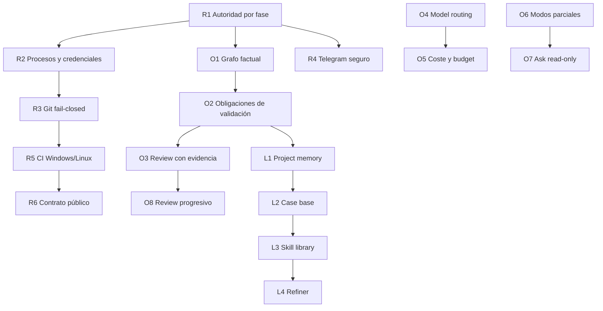

# Epic: paridad controlada de HERO v2 y sustitución de `main`

- **Estado:** abierto
- **Fecha de apertura:** 2026-08-29
- **Documento de decisión:** [Valoración de capacidades de `main` a integrar en `develop`](main-to-develop-feature-parity-assessment.md)
- **Baseline v1:** `main@ed1ff96290a16318d3717c67797b6e993bde82f5`
- **Baseline v2 auditada:** `develop@7507caa3d1815d23940ebcc7c29e2dbc61ca2c6e`
- **Tag histórico acordado:** `baseline/main-v1-ed1ff96`
- **Issue remoto:** [#2 — HERO v2 parity and controlled main replacement](https://github.com/mikelval82/hero-harness/issues/2)

## Objetivo

Hacer que HERO v2 sustituya funcionalmente a `main` sin fusionar dos historias Git no relacionadas, sin introducir una segunda autoridad de estado y sin perder las capacidades estratégicas de Graph Lab/HARNESS v2.

Este epic es el índice de ejecución. La valoración enlazada conserva el razonamiento, evidencia, riesgos y criterios completos; aquí se registra qué invariante se está trasladando, sus dependencias y su cierre verificable.

## No objetivos

- No hacer merge directo `main -> develop` ni `develop -> main`.
- No usar `--allow-unrelated-histories`.
- No copiar en bloque `src/`, prompts, agents o packaging de v1.
- No reemplazar los contratos, snapshots, leases o stores v2 con implementaciones de `main`.
- No declarar compatibilidad de proveedor o producción basándose solo en mocks.

## Contrato de contribución

Cada PR de este programa debe:

1. declarar uno o más IDs de este epic;
2. enlazar la evidencia v1 o explicar que se trata de un gap transversal;
3. describir el contrato v2 que implementa, no solo los archivos copiados;
4. incluir pruebas positivas y negativas proporcionales al riesgo;
5. confirmar que su branch comparte historia con la base y que no usó `--allow-unrelated-histories`;
6. actualizar el estado y la evidencia de este epic cuando cierre un ID.

Un PR ajeno al programa usa `PARITY-ID: N/A` y completa `NON-PARITY-REASON` para explicar por qué no altera el contrato de sustitución.

## Dependencias

R4, O4/O5 y O6/O7 pueden progresar en paralelo cuando R1 haya fijado la autoridad runtime. L1-L4 no comienzan hasta que receipts, provenance y permisos persistentes estén definidos.

## Track R — Runtime y release

### R1 — Autoridad por fase

- [x] Política de capacidades aplicada dentro del runtime.
- [x] Las fases no implementadoras no escriben el proyecto.
- [x] Los artefactos HARNESS permitidos están declarados por fase.
- [x] Tool calls directos no pueden saltarse la política.
- [x] Tests negativos y telemetría de rechazo.

**Prioridad:** P0.

**Depende de:** nada.

**Evidencia:** [contrato R1 de autoridad por fase](specs/R1-phase-authority.md), matriz efectiva en `PHASES`, 198 tests locales correctos.

**Riesgo residual:** la escritura de implementación sigue siendo de todo el proyecto hasta que el contrato produzca rutas normalizadas; el sandbox de procesos, entorno hijo y validación confiable pertenecen a R2.

### R2 — Procesos hijos y credenciales

- [ ] Ejecución `argv` con `shell=False`.
- [ ] Pipes/operadores implementados por runtime o rechazados.
- [ ] Credenciales HERO eliminadas del entorno hijo.
- [ ] Review usa validación confiable en vez de shell libre.
- [ ] Tests de escape, redirección, paths y environment.

**Prioridad:** P0.

**Depende de:** R1.

### R3 — Git fail-closed

- [ ] Preflight antes de workspace/checkout.
- [ ] Branch validada y resume ligado a branch/workspace exactos.
- [ ] Dirty baseline solo con opt-in y sin atribución incorrecta.
- [ ] Identidad Git completa y local.
- [ ] Fallos de checkout/stage/commit/merge se propagan.

**Prioridad:** P0.

**Depende de:** R1, R2.

### R4 — Telegram seguro

- [ ] Ownership único por token.
- [ ] Configuración parcial rechazada.
- [ ] Offset/backlog persistente con semántica at-most-once.
- [ ] Lifecycle `stop()` y backoff/errores clasificados.
- [ ] Comandos mutadores correlacionados con la interacción vigente.
- [ ] Si no se completa, Telegram mutador queda deshabilitado.

**Prioridad:** P0 cuando Telegram mutador esté expuesto.

**Depende de:** R1.

### R5 — CI Windows/Linux

- [ ] Suite completa en Python 3.12 sobre Windows y Ubuntu.
- [ ] Build/import/entry points y dependency check.
- [ ] Checks requeridos sobre el SHA más reciente.
- [ ] Branch protection para `main` y `develop`.
- [ ] Smokes autenticados separados de la suite sin secretos.

**Prioridad:** P0.

**Depende de:** R1-R3 para que la señal cubra el runtime endurecido.

### R6 — Contrato de proyecto público

- [ ] LICENSE conservada explícitamente.
- [ ] Nombre de distribución, módulo, autor, URLs y classifiers coherentes.
- [ ] CONTRIBUTING y templates describen v2.
- [ ] `.env.example` documenta providers sin secretos.
- [ ] README distingue verificación local, CI y E2E real.

**Prioridad:** P0/P1.

**Depende de:** R5 para publicar con señal reproducible.

## Track O — Paridad operativa

### O1 — Consultas del grafo factual

- [ ] `find_nodes`, dependencies, dependents, impact y dead code.
- [ ] API read-only, acotada y con `observed_revision`.
- [ ] Sin SQL, build, shell o path de DB controlado por el modelo.
- [ ] Graph Lab y agentes consumen el mismo contrato.

**Prioridad:** P1.

**Depende de:** R1.

### O2 — Obligaciones deterministas de validación

- [ ] Criterios bloqueantes enlazados a `ValidationObligation` tipada.
- [ ] `check_id` resuelto contra configuración confiable.
- [ ] PASS/FAIL/NOT_RUN y evidencia terminal.
- [ ] FAIL bloquea; NOT_RUN requiere evidencia alternativa explícita.

**Prioridad:** P1.

**Depende de:** O1 y R2.

### O3 — Review con evidencia y taxonomía

- [ ] Claims anclados a receipts, paths o resultados observados.
- [ ] Checks de hardcoding, special-casing y scope.
- [ ] Failure taxonomy y etapa donde se perdió recuperabilidad.
- [ ] Verificador estructural conserva autoridad independiente.

**Prioridad:** P1.

**Depende de:** O2.

### O4 — Routing de modelos

- [ ] Selección provider-neutral por fase/complejidad/retry.
- [ ] Razón y overrides reproducibles.
- [ ] Modelo solicitado separado del servido.
- [ ] Stop/finish reason fail-closed.

**Prioridad:** P1.

**Depende de:** R1.

### O5 — Coste y token budget

- [ ] Coste calculado con modelo servido y catálogo versionado.
- [ ] Precio desconocido representado como unknown.
- [ ] Budget y safe points definidos.
- [ ] Agregación sin doble conteo.

**Prioridad:** P1.

**Depende de:** O4.

### O6 — Modos parciales

- [ ] `spec-plan` es alias de `plan`, no pipeline duplicado.
- [ ] Decisión e implementación de `spec` only.
- [ ] Rutas parciales no cambian Git/proyecto.
- [ ] Paridad semántica de full/focused/hotfix/explore.

**Prioridad:** P1 de compatibilidad.

**Depende de:** R3.

### O7 — `/ask` read-only

- [ ] Solo Read/Glob/Grep y grafo factual.
- [ ] Sin Write/GraphPropose/Bash ni lease mutador.
- [ ] Límites de tamaño, turnos, tokens y deadline.
- [ ] Busy/timeout/unavailable y telemetría sin contenido.
- [ ] Mientras falte, no se anuncia como soportado.

**Prioridad:** P1.

**Depende de:** R1, O1 y O6.

### O8 — Review progresivo

- [ ] Shadow mode con baseline congelado.
- [ ] Corpus con defectos sembrados.
- [ ] Mediana/p90, findings omitidos y retrabajo medidos.
- [ ] Activación solo con no inferioridad demostrada.

**Prioridad:** P2 experimental.

**Depende de:** O2, O3 y O5.

## Track L — Aprendizaje gobernado

### L1 — Project memory

- [ ] Retrieval con fecha y provenance.
- [ ] Escrituras como proposal/diff con aprobación humana.
- [ ] Exclusión de secretos, conversación y estado transitorio.
- [ ] Identidad estable entre clones, revocación y auditoría.

**Prioridad:** P2.

**Depende de:** O2/O3 y receipts estables.

### L2 — Mission case base

- [ ] Solo misiones terminales verificadas.
- [ ] Snapshot/contract/commit/receipts como anclas.
- [ ] Schema/retención/tombstone y minimización de paths privados.
- [ ] Score y fecha visibles; revalidación contra código actual.

**Prioridad:** P2.

**Depende de:** L1.

### L3 — Skill library

- [ ] Skills versionadas con manifest de permisos.
- [ ] Evidencia de misiones y tests sandbox.
- [ ] Promoción/revocación mediante aprobación humana.
- [ ] Contenido recuperado tratado como datos no confiables.

**Prioridad:** P2 tardío.

**Depende de:** L2.

### L4 — Refiner

- [ ] Corpus suficiente y recurrencia explicable.
- [ ] Output exclusivo de propuesta.
- [ ] `approval_required=true` y `auto_apply=false`.
- [ ] Aplicación únicamente mediante una tarea normal posterior.

**Prioridad:** P2 tardío.

**Depende de:** L3 y O3.

## Definición de cierre de un ID

Un checkbox funcional no basta por sí solo. Un ID se cierra únicamente cuando:

- el contrato y los no objetivos están documentados;
- los tests positivos y negativos pasan localmente y en CI aplicable;
- existe evidencia E2E cuando la capacidad cruza procesos, browser o proveedor;
- la documentación no promete más que lo realmente validado;
- los riesgos residuales y el rollback están registrados;
- este epic enlaza el PR, commit y receipts de cierre.

## Estado de Fase 0

- [x] Valoración aceptada como decisión arquitectónica.
- [x] Epic y catálogo R/O/L creados en el repositorio.
- [x] Epic publicado como issue remoto y enlazado aquí.
- [x] Tag anotado `baseline/main-v1-ed1ff96` publicado sobre `ed1ff96`.
- [x] Gobernanza de historia y contrato de PR incorporados.
- [ ] Checks `parity-contract` y `related-history` requeridos por branch protection.
