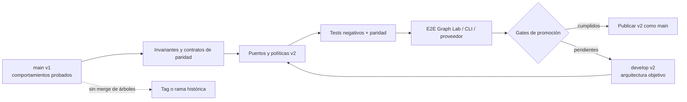

# Valoración exhaustiva de capacidades de `main` a integrar en `develop`

**Estado:** decisión arquitectónica aceptada

**Aprobada:** 2026-08-29 por el propietario del repositorio

**Fecha de corte:** 2026-08-29

**Repositorio:** `mikelval82/hero-harness`

**Revisiones auditadas:** `origin/main@ed1ff96290a16318d3717c67797b6e993bde82f5` y `origin/develop@7507caa3d1815d23940ebcc7c29e2dbc61ca2c6e`

## 1. Decisión ejecutiva

`develop` debe seguir siendo la arquitectura objetivo de HERO v2, pero todavía no puede sustituir a `main`. La recomendación no es fusionar ambos árboles ni copiar módulos completos. Es trasladar a v2, como contratos verificables, un conjunto acotado de capacidades que `main` conserva y `develop` ha perdido o solo cubre parcialmente.

La decisión se resume así:

1. **No hacer un merge directo `main -> develop` ni `develop -> main`.** Las ramas no comparten ancestro; son dos productos emparentados conceptualmente, no dos etapas lineales de la misma implementación.
2. **Integrar antes de cualquier promoción cinco bloques P0:** autoridad por fase, ejecución de procesos y protección de credenciales, preflight Git, control remoto Telegram seguro, y baseline de publicación/CI.
3. **Recuperar después, como P1, la inteligencia operativa de `main`:** consultas estructuradas del grafo, obligaciones deterministas de validación, routing de modelos y coste, compatibilidad de modos parciales, `/ask` de solo lectura y evidencia semántica de review.
4. **Introducir la memoria continua como P2 y de forma gobernada.** Project memory, case base, skills y refiner aportan valor, pero no deben copiar la escritura persistente automática de `main`; los cambios duraderos requieren procedencia, diff y aprobación humana.
5. **No portar el runtime antiguo, el analizador tree-sitter ni Tron Arena dentro del núcleo v2.** Sus contratos útiles pueden conservarse, pero sus implementaciones ya están sustituidas o no pertenecen al producto operativo.

En términos de producto, `main` **no es un subconjunto** de `develop`. `develop` es mucho más avanzado en diseño compartido con Graph Lab, snapshots, contratos, leases, verificación y reconciliación; `main` conserva mejores defensas del runtime, aprendizaje entre misiones, routing/coste, ciertas consultas del grafo y una superficie pública más madura.

## 2. Evidencia de partida y límites

### 2.1. Las ramas son historias independientes

La auditoría local produjo estos resultados:

| Comprobación | Resultado |
|---|---|
| `git merge-base origin/main origin/develop` | Sin ancestro común |
| Raíz de `main` | `05d584a` — *Initial public release of Claude Harness* |
| Raíz de `develop` | `e28c9b8` — *baseline: mission orchestrator v2 rewrite + HERO v2 vision doc* |
| Archivos en `main` | 182 |
| Archivos en `develop` | 212 |
| Solo en `main` | 159 |
| Solo en `develop` | 189 |
| Rutas compartidas | 23 |
| Conflictos contra un árbol base vacío | 23, todos `add/add` |

Esto invalida el razonamiento «aplicar los commits que faltan». Un cherry-pick de los commits P0 de `main` arrastraría nombres, dependencias y supuestos del runtime v1. Lo correcto es convertir cada invariante en un test de aceptación v2 y resolverlo detrás de los puertos actuales.

### 2.2. Estado de verificación

- El último commit de `main` tiene una [ejecución CI satisfactoria en Windows y Ubuntu](https://github.com/mikelval82/hero-harness/actions/runs/30354075928), con dos checks verdes sobre Python 3.12.
- El commit auditado de `develop` no tiene checks remotos. Su rama tampoco contiene workflow de GitHub Actions.
- `main` y `develop` aparecen sin protección de rama en la API pública de GitHub en la fecha de corte.
- La suite local de `develop` terminó con **189 tests correctos** (`python -m unittest discover -s tests`, 2026-08-29). Los clientes de proveedor se prueban con dobles locales, no con un E2E autenticado.
- La prueba DeepSeek real sigue condicionada por el bloqueo TLS de la organización. Ese límite no invalida los tests de contrato, pero impide afirmar compatibilidad real con el proveedor.

Un check local verde y un mock de SDK prueban comportamiento del código; no prueban DNS/TLS corporativo, autenticación, cuotas, variantes reales de respuesta ni Linux. Esta distinción se conserva en todas las recomendaciones.

### 2.3. Capacidades exclusivas de `develop` que forman el destino

La migración no puede llamarse exitosa si recuperar una feature v1 debilita alguno de estos contratos v2:

| Capacidad v2 a preservar | Por qué es estratégica |
|---|---|
| Worker HTTP autenticado en loopback, OpenAPI y negociación de capabilities | Mantiene Graph Lab y HARNESS desacoplados y evita entregar el token al navegador |
| Grafo de diseño autoral separado del grafo factual, con CAS y revisiones | Distingue propuesta humana/agente de hechos observados y evita lost updates |
| Snapshots aprobados y content-addressed | Fijan brief, diseño, commit y grafo como baseline auditable |
| ChangeSet, WorkPlan y task slices inmutables | Convierten intención visual en obligaciones exactas por tarea |
| Lease único para Mission, Chat y MCP | Evita dos actores mutando la misma misión simultáneamente |
| Bounded patches de Chat con SHA-256/compare-and-swap | Autoriza escritura explícita sin exponer un shell genérico |
| Verificador Python, reconciliación y receipts | Separa «el agente afirma que terminó» de evidencia estructural común |
| Scheduling por dependencias y estados bloqueados | Evita ejecutar tareas cuyos prerequisitos no están materializados |
| Event/document/session stores y control plane interactivo | Dan una única autoridad de estado observable por UI y automatización |
| Adapters Anthropic/DeepSeek detrás del mismo puerto | Permiten elección de proveedor sin contaminar el dominio |

Cada port de `main` debe entrar detrás de estos límites. Por ejemplo, el case base debe referenciar snapshots/receipts v2; no debe crear un segundo almacén de verdad. `/ask` debe consumir el grafo y control plane existentes; no levantar otro runtime de misión.

## 3. Modelo mental: cambiar el chasis, conservar los sistemas homologados

Una analogía útil es la sustitución del chasis de un vehículo. `develop` es un chasis nuevo: distribución hexagonal, control plane, Graph Lab, snapshots y contratos. `main` contiene piezas homologadas que no llegaron al nuevo chasis: cinturones, limitador de autoridad, caja negra de costes y manual de mantenimiento. Soldar los dos vehículos produciría duplicidad y puntos de rotura; desechar el anterior completo dejaría el nuevo sin defensas ya probadas.

El patrón recomendado se aproxima a *Branch by Abstraction*: definir un contrato, ejecutar pruebas de paridad contra el comportamiento anterior y cambiar consumidores gradualmente. Fowler describe esta técnica como una sustitución progresiva que mantiene el sistema construible y ejecutable durante la migración. La arquitectura transicional existe para reducir el riesgo del cambio y debe retirarse al llegar al destino, no convertirse en otra capa permanente. Véanse [Branch by Abstraction](https://martinfowler.com/bliki/BranchByAbstraction.html) y [Transitional Architecture](https://martinfowler.com/articles/patterns-legacy-displacement/transitional-architecture.html).



## 4. Criterios de decisión

Cada capacidad se ha valorado con cinco dimensiones de 1 a 5:

- **V:** valor funcional u operativo.
- **S:** reducción de riesgo de seguridad, corrupción o pérdida de trabajo.
- **F:** encaje con la arquitectura v2.
- **E:** evidencia y madurez disponibles en `main`.
- **C:** coste estimado de migración, donde 1 es pequeño y 5 alto.

La prioridad no es una suma mecánica. Una frontera de seguridad puede ser P0 aunque su valor de interfaz sea bajo. Las etiquetas significan:

- **P0:** condición previa para promocionar `develop` o exponer esa superficie.
- **P1:** necesaria para declarar que v2 sustituye funcionalmente a `main`.
- **P2:** valiosa después de estabilizar la base; preferiblemente opt-in.
- **Conservar aparte:** mantener como documentación, benchmark o activo separado.
- **No portar:** la implementación v2 ya la sustituye o su coste supera el valor.

## 5. Matriz completa de capacidades

| ID | Capacidad de `main` | Situación real en `develop` | V/S/F/E/C | Decisión |
|---|---|---|---:|---|
| R1 | Permisos por fase y bloqueo de escritura al proyecto | Las fases no implementadoras reciben `Write`; varias reciben `Bash`; la política de rutas permite proyecto y HARNESS | 5/5/5/5/3 | **Integrar P0**, rediseñada como política runtime |
| R2 | Ejecución de Bash sin shell abierto y filtrado de credenciales HERO | Los comandos compuestos pasan a `shell=True`; el entorno hijo conserva las API keys | 5/5/5/5/3 | **Integrar P0** y ampliar a DeepSeek/worker |
| R3 | Git fail-closed, branch válida, identidad completa y errores propagados | `build_runtime()` crea workspace y cambia branches sin preflight limpio ni validación de nombre | 5/5/5/5/3 | **Integrar P0** con semántica especial para resume/dirty baseline |
| R4 | Ownership de Telegram por token, backlog seguro, offset persistente, stop y errores clasificados | Listener daemon infinito, offset solo en memoria, sin lock, sin stop y con excepciones silenciadas | 3/5/4/5/4 | **P0 si Telegram queda habilitado**; si no, deshabilitar comandos mutadores |
| R5 | CI Windows/Linux | No existe workflow en `develop`; cero checks remotos para su HEAD | 5/5/5/5/2 | **Integrar P0** adaptando instalación y suite v2 |
| R6 | LICENSE, identidad pública, URLs, classifiers, CONTRIBUTING y plantillas | Faltan LICENSE/CONTRIBUTING/templates; `pyproject` usa autor y nombre genéricos | 4/4/5/5/2 | **Integrar P0/P1** antes de reemplazar la rama pública |
| O1 | `CodeGraph` con `find_nodes`, dependencies, dependents, impact y dead code | `GraphQuery(scope=facts)` solo busca declaraciones por patrón; el grafo de diseño sí es más avanzado | 4/3/5/5/3 | **Integrar P1** en el lado factual, sin copiar tree-sitter |
| O2 | Registro de checks deterministas ligado a criterios y evidencia de review | v2 tiene contratos estructurales fuertes, pero no una obligación tipada de ejecutar cada criterio funcional | 5/4/5/4/4 | **Integrar P1** como datos, no como marcadores Markdown |
| O3 | Evidence anchoring, evaluación de hardcoding y taxonomía de fallos | El gate de review v2 exige básicamente un veredicto; el verificador estructural no cubre semántica ni test gaming | 4/4/5/4/3 | **Integrar P1** en el receipt de review |
| O4 | Routing barato/default/deep por fase, complejidad y retry | Un proveedor/modelo se selecciona globalmente para toda la misión | 4/2/5/5/3 | **Integrar P1**, provider-neutral |
| O5 | Telemetría de modelo, coste estimado y token budget | v2 registra tokens y progreso, pero no coste, presupuesto ni razón de routing | 4/2/5/5/3 | **Integrar P1** junto con O4 |
| O6 | Modos `spec` y `spec-plan` | `plan` de v2 ya ejecuta `SPEC -> PLAN`; no hay modo `spec` ni alias `spec-plan` | 3/1/5/5/2 | **P1 de compatibilidad**: alias y modo spec-only |
| O7 | `/ask` asíncrono y estrictamente read-only | El parser reconoce `ask`, pero el listener no lo atiende ni lo muestra en help | 3/4/4/5/3 | **Integrar P1** o retirar el comando hasta implementarlo |
| O8 | Estrategia de review progresivo y auditoría final de integración | Existe como propuesta en `main`, no como capacidad probada | 4/2/4/2/4 | **Experimentar P2**, no vender como paridad |
| L1 | `PROJECT_MEMORY.md` persistente por proyecto | No hay memoria durable entre misiones | 4/3/4/5/4 | **Integrar P2** con aprobación explícita de cada escritura |
| L2 | Mission case base recuperable | No hay recuperación de casos anteriores | 4/3/4/5/3 | **Integrar P2** después de L1 y receipts estables |
| L3 | Biblioteca de procedimientos verificados | No hay biblioteca persistente ni retrieval de skills | 3/4/3/4/4 | **Integrar P2 tardío**, con firma/procedencia y promoción humana |
| L4 | Refiner post-misión que solo propone | No existe | 3/3/4/4/3 | **Integrar P2 tardío** cuando haya corpus; conservar `auto_apply=false` |
| A1 | Commands interactivos de metodología | Graph Lab/control plane cubren parte del flujo; los commands dependen de convenciones Claude v1 | 2/1/3/3/2 | **Portar selectivamente**, no copiar la carpeta completa |
| A2 | Research, glosario, checkpoints y diagramas públicos | v2 tiene worklogs/specs distintos y más actuales | 3/1/5/5/2 | **Curar y archivar**; convertir decisiones vigentes en ADR v2 |
| A3 | Tron Arena | No existe y no participa en el contrato Graph Lab/HARNESS | 1/1/1/5/3 | **Conservar aparte**, no como dependencia del runtime |
| X1 | Runner, contexto, gates y prompts v1 | v2 ya tiene dominio, puertos, control plane y servicios propios | 1/2/1/5/5 | **No portar**; extraer solo invariantes |
| X2 | Analizador tree-sitter v1 | v2 tiene SQLite/AST incremental, revisiones observadas y diseño separado | 2/2/2/5/4 | **No portar**; ampliar adaptadores por lenguaje en el futuro |
| X3 | Workspace efímero y compactación hot/cold | Ya existen equivalentes v2 | 4/3/5/5/2 | **Paridad suficiente**; solo añadir tests si aparecen regresiones |
| X4 | `requirements.txt` y launcher batch antiguo | v2 usa `pyproject.toml` y entry points `mission`, `mission-worker`, `code-graph` | 1/1/4/5/1 | **No portar**; documentar instalación moderna |

## 6. P0: capacidades que deben entrar antes de promocionar v2

### 6.1. R1 — Autoridad por fase, aplicada en runtime

#### Evidencia

En [`phase_registry.py`](../../src/mission_orchestrator/application/phase_registry.py), `DEFAULT_TOOLS` incluye `Read`, `Write`, `Glob`, `Grep` y `Bash`. Research, Structure, Spec y Plan heredan esa superficie; Review también recibe `Write` y `Bash`. En [`path_policy.py`](../../src/mission_orchestrator/adapters/tools/path_policy.py), `validate_write_path()` solo delega en una comprobación que acepta cualquier ruta dentro del proyecto **o** del workspace HARNESS.

`main` separa dos decisiones: una fase puede disponer de `Write` para producir su artefacto en HARNESS, pero `allow_project_writes` permanece falso salvo en implementación/reimplementación. El commit `f7936c5` añade esa frontera y tests negativos.

#### Decisión de diseño v2

No debe copiarse el booleano tal cual. v2 necesita una política explícita por invocación:

```text
PhaseCapability
  project_read: bool
  project_write: none | contract_paths | project
  harness_write: lista de artefactos declarados
  process: none | trusted_validation | bounded_shell
  graph_read: facts | design
  graph_write: none | propose
```

La política debe validarse dentro del registro/ejecutor de herramientas, no solo al construir el schema enviado al modelo. Así se mantiene la «mediación completa»: aunque un cliente invente una llamada o conserve un schema antiguo, el runtime la rechaza.

OWASP identifica la funcionalidad, permisos y autonomía excesivos como causas de *Excessive Agency* y recomienda exponer solo las herramientas mínimas, evitar extensiones abiertas y comprobar la autorización en el sistema que ejecuta la acción. Esto respalda retirar `Bash` y escritura de fases que solo deben observar o diseñar, no confiar en que el prompt se comporte bien. Véase [OWASP LLM06: Excessive Agency](https://genai.owasp.org/llmrisk/llm062025-excessive-agency/).

#### Aceptación mínima

- Research/Structure/Grill/Spec/Plan no pueden escribir ningún archivo del proyecto.
- Review no puede escribir el proyecto y solo puede producir su receipt/audit declarado.
- Compact/Consolidate/Report solo escriben artefactos HARNESS permitidos.
- Implement/Reimplement conservan escritura, limitada al contrato cuando exista un task slice aprobado.
- `GraphPropose` solo está disponible donde el flujo permite modificar el borrador de diseño.
- Un tool call no autorizado falla aunque se invoque directamente contra el registry.
- Cada rechazo emite evento con fase, herramienta y razón, sin incluir secretos ni contenido sensible.

### 6.2. R2 — Procesos hijos sin shell abierto ni credenciales HERO

#### Evidencia

[`bash_executor.py`](../../src/mission_orchestrator/adapters/tools/bash_executor.py) usa `shell=True` cuando hay más de un segmento. Aunque `BashPolicy` parsea una allowlist, el string original vuelve a entrar en el intérprete de comandos. Además, el proceso hereda `os.environ` de forma implícita.

`main` divide pipelines y ejecuta cada `argv` sin entregar el string a otro shell. También elimina del entorno hijo las credenciales controladas por HERO.

#### Decisión de diseño v2

- Ejecutar siempre listas `argv` con `shell=False`.
- Implementar pipes y operadores permitidos en el runtime, o prohibirlos hasta tener semántica controlada.
- Eliminar al menos `ANTHROPIC_API_KEY`, `DEEPSEEK_API_KEY`, `TELEGRAM_TOKEN`, `TELEGRAM_CHAT_ID` y cualquier token del worker/control plane.
- No presentar la allowlist como sandbox completa: el código objetivo y los intérpretes siguen ejecutándose con los permisos del usuario.
- Sustituir el Bash de Review por `RunValidation(check_id)` sobre comandos configurados y aprobados; nunca ejecutar comandos generados dentro de `spec.md` como autoridad suficiente.

OWASP AST03 exige enforcement de permisos en runtime y consentimiento explícito para cambios persistentes; una declaración en el prompt o manifest no basta. Véase [OWASP AST03: Over-Privileged Skills](https://owasp.org/www-project-agentic-skills-top-10/ast03).

#### Pruebas negativas

- Un comando compuesto no puede introducir un ejecutable fuera de la allowlist.
- Redirecciones, sustituciones, heredocs y background jobs se rechazan.
- Un test hijo confirma que las claves HERO no existen en su entorno.
- `python -c` y equivalentes permanecen bloqueados salvo política explícita y aislada.
- Paths absolutos, `..`, symlinks/junctions y cambios de cwd no escapan de los roots autorizados.

### 6.3. R3 — Git transaccional y fail-closed

#### Evidencia

[`bootstrap.py`](../../src/mission_orchestrator/bootstrap.py) prepara el workspace y después llama a `ensure_develop()` y `setup_branch()`. [`service.py`](../../src/mission_orchestrator/adapters/git/service.py) hace checkout/create sin:

- comprobar primero si el repositorio está limpio;
- validar la branch con `git check-ref-format --branch`;
- distinguir misión nueva de `resume`;
- exigir branch adjunta y exacta al reanudar;
- evitar que un fallback de checkout cambie a una referencia ambigua.

`main` cubre estos casos en `src/core/git.py` y los activa antes de una misión mutadora. Esta capacidad debe recuperarse, pero armonizada con la decisión v2 de registrar una dirty baseline en los receipts.

#### Semántica propuesta

| Camino | Comportamiento |
|---|---|
| `explore`, `spec`, `plan` | No cambiar branch ni identidad Git; son rutas sin merge |
| Misión mutadora nueva | Repositorio válido, branch válida y worktree limpio por defecto |
| Misión nueva con dirty baseline | Solo con opt-in explícito; snapshot de paths+hashes, sin stage/commit/merge automático de cambios previos |
| `--resume` | Exigir workspace y branch esperados; aceptar el estado de la propia misión sin checkout implícito |
| Merge final | Validación, reconciliación, índice atribuible a la misión y restauración segura ante fallo |

El orden importa: el preflight debe ocurrir antes de crear/reemplazar el workspace o cambiar Git. También deben comprobarse todos los return codes y conservar stderr útil sin imprimir secretos.

#### Aceptación mínima

- Una misión mutadora no toca un árbol sucio sin consentimiento explícito.
- Una branch inválida o detached HEAD falla antes de mutar.
- Nombre/email se consideran un par y cualquier configuración automática es local al repo.
- `resume` nunca se convierte silenciosamente en una misión nueva.
- El commit final no incluye paths preexistentes ni staged ajenos.
- Un checkout, stage, commit, merge o abort fallido no se anuncia como éxito.

### 6.4. R4 — Telegram: trasladar invariantes, no el modelo v1 de routing

#### Evidencia

El listener v2:

- corre en un daemon sin `stop()`;
- guarda `offset` solo en memoria;
- reintenta todas las excepciones inmediatamente y sin clasificación;
- no tiene lock por token;
- no descarta/persiste backlog de forma at-most-once;
- mantiene `/missions` y routing por tags;
- enumera `ask` como comando, pero no lo ejecuta.

La decisión v2 de soportar varias misiones puede mantenerse. Lo que debe importarse de `main` son los invariantes de ownership y entrega: un token de bot solo tiene un consumidor, un comando mutador se correlaciona con la interacción vigente y los updates antiguos no controlan una misión nueva.

#### Opción segura de release

Antes de resolverlo hay dos opciones válidas:

1. portar lock, lifecycle, offsets, backoff y correlación; o
2. deshabilitar temporalmente los comandos mutadores de Telegram y conservar solo notificaciones/lecturas.

Mantener el listener actual como control remoto de una misión no es una opción de promoción segura.

### 6.5. R5/R6 — CI, protección de rama y contrato de proyecto público

`main` aporta una matriz Windows/Ubuntu, LICENSE MIT, metadata pública, contributing y templates. `develop` no tiene checks remotos ni LICENSE. Si v2 reemplazase hoy a `main`, el repositorio perdería simultáneamente señal de portabilidad y declaración de licencia en la rama publicada.

El workflow no debe copiar `requirements.txt`; debe adaptarse a `pyproject.toml`:

1. Python 3.12 en `windows-latest` y `ubuntu-latest`.
2. Instalación editable con extras de test y adapters importables sin credenciales.
3. Suite completa v2.
4. `pip check` o equivalente.
5. Checks de package build/import y `mission --help`/`mission-worker --help`.
6. Branch rule que exija ambos jobs y revisión antes de actualizar `main`.

GitHub indica que un required check debe pasar sobre el SHA más reciente y que una branch protegida puede exigir que el PR esté actualizado. Véase [GitHub: troubleshooting required status checks](https://docs.github.com/en/pull-requests/how-tos/merge-and-close-pull-requests/troubleshooting-required-status-checks?apiVersion=2022-11-28).

La metadata debe decidir explícitamente si la distribución pública seguirá llamándose `hero-harness` aunque el paquete importable sea `mission_orchestrator`. LICENSE, autor, URLs, classifiers y README deben ser coherentes. `.env.example` debe documentar Anthropic y DeepSeek sin contener claves reales.

## 7. P1: paridad operativa que merece reimplementarse

### 7.1. O1 — Consultas estructuradas del grafo factual

v2 supera a `main` en diseño autoral, CAS, revisiones y resolución contra el código. Sin embargo, su `GraphQuery(scope="facts")` solo llama a `find_node(pattern)`. `main` ya expone cinco operaciones read-only y acotadas: búsqueda, dependencias, dependientes, impacto y dead code.

La integración debe ampliar el puerto del **grafo observado**, no mezclarlo con `DesignStore`:

```text
ObservedCodeGraphQuery
  find_nodes(pattern, limit)
  dependencies(node, limit)
  dependents(node, limit)
  impact(node, limit)
  dead_code(limit)
```

No deben portarse construcción del grafo, path de DB configurable ni SQL libre. La salida debe incluir `observed_revision`, truncation y limitación de filas. Graph Lab y los agentes deben poder consumir el mismo contrato.

### 7.2. O2/O3 — De checks Markdown a evidencia tipada

`main` obliga al specifier a asociar `DC*` con criterios de aceptación y al reviewer a declarar `PASS`, `FAIL` o `NOT_RUN` con evidencia. v2 ya ofrece algo más fuerte para estructura: task contracts inmutables, `PythonContractVerifier`, receipts y reconciliación. Lo que falta es el puente entre criterios funcionales y ejecución observable.

No se recomienda copiar la colección de regex y headings de `src/core/gate.py`. La versión v2 debería introducir:

```text
ValidationObligation
  id
  requirement_ids
  kind: trusted_command | static | browser | manual
  target/check_id
  expected
  provenance

ValidationEvidence
  obligation_id
  status: pass | fail | not_run
  actor
  observed_at
  receipt/document_ref
  detail
```

Reglas:

- todo criterio bloqueante tiene al menos una obligación;
- el runtime resuelve `check_id` contra configuración confiable, no ejecuta shell generado por el LLM;
- `FAIL` bloquea y `NOT_RUN` exige evidencia alternativa explícita;
- la verificación estructural sigue siendo independiente y no se sustituye por una afirmación del reviewer;
- el receipt incluye checks de hardcoding/special-casing, alcance del diff y claims sin evidencia;
- la auditoría final se limita a integración, no repite todo el review por tarea.

### 7.3. O4/O5 — Policy de modelos, identidad servida, coste y presupuesto

`main` selecciona tiers por fase, complejidad, modo y retry; usa modelos baratos en compact/report y profundos en grill/review/reimplement. También suma coste estimado y permite un token budget. v2 selecciona proveedor/modelo una vez en `build_runtime()` y solo registra tokens.

La versión v2 debe ser provider-neutral:

- `ModelPolicyPort.select(phase, complexity, retry, provider_capabilities)`;
- razón de selección registrada;
- `requested_provider/model` y `served_provider/model` separados;
- coste calculado solo con modelo servido y catálogo versionado;
- precio desconocido produce `cost=unknown`, nunca cero engañoso;
- presupuesto informa y, si va a bloquear, lo hace en un safe point definido;
- override global sigue disponible para reproducibilidad.

Los precios hardcodeados de `main` no deben copiarse sin verificar vigencia. La feature que se porta es la política y su trazabilidad, no esos importes concretos.

### 7.4. O6 — Compatibilidad de modos sin duplicar conceptos

La equivalencia correcta es:

| `main` | `develop` | Decisión |
|---|---|---|
| `spec-plan` | `plan` ejecuta `SPEC -> PLAN`, reporta sin merge | Añadir alias compatible y documentar deprecación |
| `spec` | No equivalente | Añadir spec-only si sigue siendo un flujo de usuario |
| `full`, `focused`, `hotfix`, `explore` | Existen | Conservar tests de paridad semántica |

No debe añadirse un segundo modo `spec-plan` con pipeline duplicado. Debe resolverse al enum/canonical mode `plan`. Tanto `spec` como `plan` deben ser no mutadores respecto a Git/proyecto salvo sus artefactos HARNESS.

### 7.5. O7 — `/ask` read-only sobre el control plane

El comando aporta una consulta remota útil, pero el estado actual de v2 es peor que una ausencia explícita: el parser lo reconoce y luego lo ignora. La implementación debe:

- usar solo Read/Glob/Grep y el grafo factual;
- no recibir Write, GraphPropose ni Bash;
- tener límite de longitud, turnos, tokens, resultados y deadline compartido;
- permitir una consulta simultánea por misión;
- registrar outcome/tokens, nunca pregunta/respuesta;
- aislarse del lease mutador;
- responder claramente busy/timeout/unavailable.

Si no se implementa en P1, hay que retirarlo de `STATUS_COMMANDS` hasta entonces.

### 7.6. O8 — Review progresivo: conservar como experimento

`main` contiene una propuesta documentada de review ligero/completo y auditoría final. No hay evidencia suficiente para afirmar que reduzca tokens sin perder defectos. Debe probarse en shadow mode con:

- mediana y p90 de tokens/turnos;
- findings bloqueantes omitidos;
- retrabajo downstream;
- fallos sembrados de API, schema, hardcoding y scope;
- integración entre tareas.

Solo debe activarse si demuestra no inferioridad. Esta propuesta no cuenta como feature ya implementada en `main`.

## 8. P2: aprendizaje continuo, con gobierno más estricto que en `main`

### 8.1. Orden recomendado


### 8.2. L1 — Project memory

La memoria de `main` separa convenciones duraderas de artefactos temporales y prohíbe secretos en su plantilla. El valor es alto: evita redescubrir comandos y fallos recurrentes. El problema es que el runner sincroniza automáticamente la copia editada al almacenamiento persistente al cerrar.

La versión v2 debería:

- recuperar memoria como contexto no autoritativo y con fecha/procedencia;
- generar un diff `MemoryProposal`;
- exigir aprobación explícita antes de persistir;
- excluir secretos, conversación privada, branches transitorias y paths absolutos innecesarios;
- identificar proyecto de forma estable entre clones, sin depender solo del path local;
- permitir revocar, editar y auditar entradas.

NIST recomienda que el gobierno, mapa, medición y gestión del riesgo sean continuos y que roles, supervisión y responsabilidades estén documentados. Esto encaja con tratar la memoria como estado gobernado, no como texto que el agente puede reescribir silenciosamente. Véase [NIST AI RMF Core](https://airc.nist.gov/airmf-resources/airmf/5-sec-core/).

### 8.3. L2 — Mission case base

La implementación de `main` recupera top-k por similitud lexical y guarda solo misiones aprobadas/no bloqueadas. El MVP es razonable, pero debe mejorarse antes de portarlo:

- guardar IDs de snapshot, contract, commit y receipts en vez de resúmenes sin ancla;
- no guardar el path absoluto del usuario salvo necesidad;
- considerar solo casos con verificación terminal válida;
- marcar versión de schema y política de retención;
- mostrar score y fecha; el agente debe revalidar contra el código actual;
- soportar tombstone/revocación de casos incorrectos.

### 8.4. L3 — Skill library

`main` distingue bien memoria narrativa, casos episódicos y procedimientos. Sin embargo, `status: verified` dentro de un Markdown generado no es suficiente para promover una skill persistente.

La promoción v2 debe requerir:

- identidad y versión inmutables;
- manifest de permisos;
- receipts concretos de las misiones que la justifican;
- revisión humana del contenido y de los permisos;
- tests sandbox que comparen permisos declarados con comportamiento observado;
- retirada/revocación y prevención de duplicados semánticos.

Las skills recuperadas son datos no confiables hasta ser seleccionadas y autorizadas; nunca deben escalarse a instrucciones de sistema por el mero hecho de estar en el índice.

### 8.5. L4 — Refiner

El diseño de `main` ya establece el principio correcto:

```text
fallos recurrentes -> propuesta -> aprobación humana -> tarea normal
```

El refiner solo debe llegar después de tener failure taxonomy, receipts y un corpus suficiente. Deben conservarse `approval_required=true` y `auto_apply=false`. El output no puede editar prompts, agentes, tests, memoria ni skills. Dos coincidencias lexicales pueden servir para sugerir investigación, no para afirmar causalidad.

## 9. Activos que deben conservarse sin entrar en el runtime

### 9.1. Commands interactivos

Los commands de `main` mezclan tres clases:

- fases manuales que duplican el pipeline (`spec-task`, `plan-task`, etc.);
- utilidades de trabajo (`diagnose`, `zoom-out`, `context-audit`);
- mantenimiento del harness (`refine-harness`, `write-a-skill`).

No conviene copiar una carpeta ligada a `~/.claude`, `$CLAUDE_HARNESS` y convenciones v1. `diagnose`, `zoom-out` y alineación pueden transformarse en acciones de Graph Lab o recetas de documentación; las fases manuales deben invocar los mismos servicios del control plane, no un segundo flujo de prompts.

### 9.2. Metodología y research

Conviene conservar el contenido histórico en un tag o rama y trasladar únicamente decisiones todavía vigentes a ADRs de v2. `AGENTS.md`, `CHECKPOINTS.md` y `GLOSSARY.md` describen nombres y rutas v1; copiarlos sin edición crearía documentación falsa.

### 9.3. Tron Arena

Tron Arena es un benchmark autónomo y probado, pero no mide directamente el contrato Graph Lab/HARNESS ni debe aumentar dependencias del worker. Puede vivir en una distribución, tag o repositorio de benchmarks. Si se desea conservar una métrica de calidad para v2, es preferible crear un corpus de misiones congeladas y fallos sembrados sobre contratos reales.

## 10. Implementaciones que no deben trasladarse

### 10.1. Runtime v1

No portar `src/mission`, `src/core/context.py`, `src/agent/loop.py` ni `src/harness` como otra pila paralela. v2 ya tiene dominio, puertos, control plane, sesiones, documentos, eventos y leases. Dos autoridades provocarían divergencia de estado y duplicarían los fixes.

### 10.2. Analizador tree-sitter

No reemplazar el analizador v2 por el de `main`. Ambos son hoy Python-first y v2 añade revisionado observado, separación structural/lexical, almacenamiento incremental y coordinación con DesignStore. Debe portarse la **API de consulta faltante**, no el motor. Soporte multi-lenguaje merece un adapter separado cuando exista un caso concreto.

### 10.3. Gates Markdown literales

Los headings y regex de `main` son evidencia de qué conceptos importan, no el modelo de datos objetivo. v2 debe elevarlos a task contracts y receipts tipados. Mantener regex como guardrail de compatibilidad temporal puede ser útil, pero no como autoridad final.

### 10.4. Packaging legacy

No reintroducir `requirements.txt` ni el launcher batch como fuentes de verdad. El `pyproject.toml` v2 y sus entry points son más adecuados. Sí deben recuperarse la licencia, metadata, extras de test y documentación de instalación.

## 11. Riesgos críticos que no resuelve `main`

Una valoración honesta no debe confundir «paridad con main» con «listo para producción». Hay un defecto transversal visible en ambos linajes: la validación de respuestas del proveedor no es fail-closed.

### 11.1. Stop/finish reason e identidad servida

En `develop`:

- Anthropic no valida `response.stop_reason` antes de aceptar una respuesta sin tool calls.
- DeepSeek indexa `choices[0]` y no valida `finish_reason`.
- una respuesta truncada, refusal, pausa o payload malformado puede convertirse en un `PhaseResult` aparentemente válido o en una excepción genérica.

El `main` auditado tampoco ofrece una solución completa: su loop admite el camino de `max_tokens` como texto parcial. Por tanto esto no es una feature a importar, sino un gate adicional de promoción.

Se necesita un contrato provider-neutral:

```text
ProviderOutcome
  completed
  tool_use
  truncated
  refused
  paused
  malformed
  transport_error
  quota_error
```

Solo `completed` o `tool_use` coherente deben avanzar. El evento debe separar modelo solicitado y servido, stop reason, status HTTP y clasificación, sin guardar contenido sensible.

### 11.2. E2E real

Antes de sustituir `main` debe existir, al menos:

- un smoke autenticado con un proveedor aprobado por la organización;
- un caso de tool-use, un caso sin tools y un rechazo/truncado deliberado;
- una misión Graph Lab -> worker -> contrato -> ejecución -> verificación;
- un caso negativo que no pueda cerrarse como éxito;
- Windows y Ubuntu CI para todo lo que no dependa de credenciales;
- constancia explícita de proveedores no verificados.

## 12. Roadmap recomendado

### Fase 0 — Congelar el contrato de sustitución

- Aprobar este documento o sus cambios.
- Crear un epic con IDs R1-R6, O1-O8 y L1-L4.
- Etiquetar `main@ed1ff96` como baseline histórico.
- Prohibir merge de árboles no relacionados; cada PR v2 referencia el invariante que porta.

#### Gobernanza aceptada para los ports

- Queda prohibido usar `--allow-unrelated-histories` o integrar directamente los árboles `main` y `develop`.
- Cada PR de paridad declara al menos un ID R1-R6, O1-O8 o L1-L4 y enlaza evidencia fijada a `main@ed1ff96`.
- El PR describe el contrato observable v2 y su aceptación; no basta con trasladar archivos o hacer pasar mocks.
- Los ports se implementan detrás de los puertos, stores y autoridades v2; no se copia el runtime v1 como una segunda pila.
- El contrato operativo completo vive en [Gobernanza de migración](migration-governance.md) y su seguimiento en el [epic de paridad](main-develop-parity-epic.md).

### Fase 1 — P0 runtime y release

Orden propuesto:

1. R1 política de capacidades y tests negativos.
2. R2 executor sin shell + filtrado de credenciales.
3. R3 preflight Git y semántica resume/dirty baseline.
4. R4 ownership/lifecycle Telegram o deshabilitación mutadora.
5. R5/R6 CI, LICENSE, metadata y branch rules.
6. ProviderOutcome fail-closed, aunque no provenga de `main`.

Los cambios deben ir en PRs separados para que una regresión sea reversible.

### Fase 2 — P1 paridad operativa

1. O1 consultas factuales del grafo.
2. O2/O3 obligaciones y receipts de validación/review.
3. O4/O5 policy de modelos, modelo servido, coste y budgets.
4. O6 aliases/modos parciales.
5. O7 `/ask` read-only.
6. E2E y tabla de paridad main/v2 ejecutada sobre escenarios congelados.

### Fase 3 — P2 aprendizaje gobernado

1. Project memory en modo lectura + proposals.
2. Case base sobre receipts aprobados.
3. Skills versionadas y aprobadas.
4. Refiner offline proposal-only.
5. Experimento O8 de review progresivo en shadow mode.

### Fase 4 — Promoción

- PR de `develop` hacia una rama de integración basada en la historia que vaya a conservarse.
- Decisión explícita de estrategia Git: reemplazo controlado de `main`, no merge accidental de historias.
- Checks requeridos sobre el SHA final.
- Smoke Graph Lab/HARNESS y proveedor.
- Release note que enumere capacidades mantenidas, renombradas, retiradas y aún experimentales.
- Tag de la última v1 y ruta de rollback.

## 13. Gate de salida: cuándo puede v2 reemplazar `main`

La promoción solo debería aprobarse si todas estas afirmaciones tienen evidencia:

- [ ] Ninguna fase no implementadora puede modificar el proyecto mediante tool calls directos.
- [ ] Ningún proceso hijo recibe credenciales HERO ni se ejecuta mediante shell abierto.
- [ ] Git no altera trabajo preexistente sin opt-in y `resume` conserva identidad de misión/branch.
- [ ] Telegram mutador está endurecido o deshabilitado.
- [ ] CI Windows y Ubuntu pasa sobre el SHA de promoción.
- [ ] LICENSE, metadata pública, README y comandos de instalación son coherentes.
- [ ] Grafo factual ofrece las consultas de impacto necesarias sin SQL/shell libre.
- [ ] Todo criterio bloqueante tiene evidencia terminal tipada.
- [ ] Modelo solicitado/servido, tokens, stop reason y coste conocido/desconocido son trazables.
- [ ] `spec-plan` tiene compatibilidad clara y `spec` una decisión explícita.
- [ ] `/ask` es realmente read-only o no se anuncia.
- [ ] Existe un E2E positivo y uno negativo Graph Lab/HARNESS.
- [ ] Existe al menos un smoke real de proveedor aprobado; los demás figuran como no verificados.
- [ ] No se ha introducido una segunda autoridad de estado ni una segunda pila runtime.

## 14. Mapa de evidencia en `main`

Los enlaces siguientes fijan la evidencia al SHA auditado; no dependen de futuros cambios de la rama:

| Capacidad | Implementación/diseño en `main@ed1ff96` | Pruebas relevantes |
|---|---|---|
| R1 permisos por fase | [`context.py`](https://github.com/mikelval82/hero-harness/blob/ed1ff96290a16318d3717c67797b6e993bde82f5/src/core/context.py), [`path_policy.py`](https://github.com/mikelval82/hero-harness/blob/ed1ff96290a16318d3717c67797b6e993bde82f5/src/agent/path_policy.py), [`phase_runner.py`](https://github.com/mikelval82/hero-harness/blob/ed1ff96290a16318d3717c67797b6e993bde82f5/src/mission/phase_runner.py) | [`test_tools.py`](https://github.com/mikelval82/hero-harness/blob/ed1ff96290a16318d3717c67797b6e993bde82f5/src/tests/test_tools.py), [`test_context.py`](https://github.com/mikelval82/hero-harness/blob/ed1ff96290a16318d3717c67797b6e993bde82f5/src/tests/test_context.py) |
| R2 procesos/credenciales | [`bash_policy.py`](https://github.com/mikelval82/hero-harness/blob/ed1ff96290a16318d3717c67797b6e993bde82f5/src/agent/bash_policy.py), [`bash_executor.py`](https://github.com/mikelval82/hero-harness/blob/ed1ff96290a16318d3717c67797b6e993bde82f5/src/agent/bash_executor.py) | [`test_tools.py`](https://github.com/mikelval82/hero-harness/blob/ed1ff96290a16318d3717c67797b6e993bde82f5/src/tests/test_tools.py) |
| R3 Git fail-closed | [`git.py`](https://github.com/mikelval82/hero-harness/blob/ed1ff96290a16318d3717c67797b6e993bde82f5/src/core/git.py), [`cli.py`](https://github.com/mikelval82/hero-harness/blob/ed1ff96290a16318d3717c67797b6e993bde82f5/src/cli.py) | [`test_git.py`](https://github.com/mikelval82/hero-harness/blob/ed1ff96290a16318d3717c67797b6e993bde82f5/src/tests/test_git.py) |
| R4 Telegram | [`telegram_lock.py`](https://github.com/mikelval82/hero-harness/blob/ed1ff96290a16318d3717c67797b6e993bde82f5/src/integrations/telegram_lock.py), [`telegram_listener.py`](https://github.com/mikelval82/hero-harness/blob/ed1ff96290a16318d3717c67797b6e993bde82f5/src/integrations/telegram_listener.py), [contrato](https://github.com/mikelval82/hero-harness/blob/ed1ff96290a16318d3717c67797b6e993bde82f5/docs/design/telegram_single_mission.md) | [`test_single_mission_control.py`](https://github.com/mikelval82/hero-harness/blob/ed1ff96290a16318d3717c67797b6e993bde82f5/src/tests/test_single_mission_control.py), [`test_telegram_transport_single.py`](https://github.com/mikelval82/hero-harness/blob/ed1ff96290a16318d3717c67797b6e993bde82f5/src/tests/test_telegram_transport_single.py) |
| R5/R6 publicación | [`ci.yml`](https://github.com/mikelval82/hero-harness/blob/ed1ff96290a16318d3717c67797b6e993bde82f5/.github/workflows/ci.yml), [`LICENSE`](https://github.com/mikelval82/hero-harness/blob/ed1ff96290a16318d3717c67797b6e993bde82f5/LICENSE), [`pyproject.toml`](https://github.com/mikelval82/hero-harness/blob/ed1ff96290a16318d3717c67797b6e993bde82f5/pyproject.toml), [`CONTRIBUTING.md`](https://github.com/mikelval82/hero-harness/blob/ed1ff96290a16318d3717c67797b6e993bde82f5/CONTRIBUTING.md) | [CI verde del SHA](https://github.com/mikelval82/hero-harness/actions/runs/30354075928) |
| O1 grafo factual | [`code_graph_queries.py`](https://github.com/mikelval82/hero-harness/blob/ed1ff96290a16318d3717c67797b6e993bde82f5/src/analysis/code_graph_queries.py), [`code_graph_tool.py`](https://github.com/mikelval82/hero-harness/blob/ed1ff96290a16318d3717c67797b6e993bde82f5/src/agent/code_graph_tool.py) | [`test_code_graph.py`](https://github.com/mikelval82/hero-harness/blob/ed1ff96290a16318d3717c67797b6e993bde82f5/src/tests/test_code_graph.py) |
| O2/O3 validación/review | [`gate.py`](https://github.com/mikelval82/hero-harness/blob/ed1ff96290a16318d3717c67797b6e993bde82f5/src/core/gate.py), [registro de checks](https://github.com/mikelval82/hero-harness/blob/ed1ff96290a16318d3717c67797b6e993bde82f5/docs/design/deterministic_check_registry.md), [`reviewer.md`](https://github.com/mikelval82/hero-harness/blob/ed1ff96290a16318d3717c67797b6e993bde82f5/agents/reviewer.md) | [`test_gate.py`](https://github.com/mikelval82/hero-harness/blob/ed1ff96290a16318d3717c67797b6e993bde82f5/src/tests/test_gate.py), [`test_prompt_contracts.py`](https://github.com/mikelval82/hero-harness/blob/ed1ff96290a16318d3717c67797b6e993bde82f5/src/tests/test_prompt_contracts.py) |
| O4/O5 modelos/coste | [`model_policy.py`](https://github.com/mikelval82/hero-harness/blob/ed1ff96290a16318d3717c67797b6e993bde82f5/src/core/model_policy.py), [`telemetry.py`](https://github.com/mikelval82/hero-harness/blob/ed1ff96290a16318d3717c67797b6e993bde82f5/src/harness/telemetry.py) | [`test_model_policy.py`](https://github.com/mikelval82/hero-harness/blob/ed1ff96290a16318d3717c67797b6e993bde82f5/src/tests/test_model_policy.py), [`test_telemetry.py`](https://github.com/mikelval82/hero-harness/blob/ed1ff96290a16318d3717c67797b6e993bde82f5/src/tests/test_telemetry.py) |
| O6 modos parciales | [`context.py`](https://github.com/mikelval82/hero-harness/blob/ed1ff96290a16318d3717c67797b6e993bde82f5/src/core/context.py), [diseño](https://github.com/mikelval82/hero-harness/blob/ed1ff96290a16318d3717c67797b6e993bde82f5/docs/design/partial_harness_mode.md) | [`test_context.py`](https://github.com/mikelval82/hero-harness/blob/ed1ff96290a16318d3717c67797b6e993bde82f5/src/tests/test_context.py) |
| O7 `/ask` | [`code_questions.py`](https://github.com/mikelval82/hero-harness/blob/ed1ff96290a16318d3717c67797b6e993bde82f5/src/integrations/code_questions.py) | [`test_internal_code_questions.py`](https://github.com/mikelval82/hero-harness/blob/ed1ff96290a16318d3717c67797b6e993bde82f5/src/tests/test_internal_code_questions.py) |
| L1 memoria | [`project_memory.py`](https://github.com/mikelval82/hero-harness/blob/ed1ff96290a16318d3717c67797b6e993bde82f5/src/harness/project_memory.py) | [`test_project_memory.py`](https://github.com/mikelval82/hero-harness/blob/ed1ff96290a16318d3717c67797b6e993bde82f5/src/tests/test_project_memory.py) |
| L2 casos | [`case_base.py`](https://github.com/mikelval82/hero-harness/blob/ed1ff96290a16318d3717c67797b6e993bde82f5/src/harness/case_base.py), [diseño](https://github.com/mikelval82/hero-harness/blob/ed1ff96290a16318d3717c67797b6e993bde82f5/docs/design/mission_case_base.md) | [`test_case_base.py`](https://github.com/mikelval82/hero-harness/blob/ed1ff96290a16318d3717c67797b6e993bde82f5/src/tests/test_case_base.py) |
| L3 skills | [`skill_library.py`](https://github.com/mikelval82/hero-harness/blob/ed1ff96290a16318d3717c67797b6e993bde82f5/src/harness/skill_library.py), [diseño](https://github.com/mikelval82/hero-harness/blob/ed1ff96290a16318d3717c67797b6e993bde82f5/docs/design/skill_library.md) | [`test_skill_library.py`](https://github.com/mikelval82/hero-harness/blob/ed1ff96290a16318d3717c67797b6e993bde82f5/src/tests/test_skill_library.py) |
| L4 refiner | [`refiner.py`](https://github.com/mikelval82/hero-harness/blob/ed1ff96290a16318d3717c67797b6e993bde82f5/src/harness/refiner.py), [diseño](https://github.com/mikelval82/hero-harness/blob/ed1ff96290a16318d3717c67797b6e993bde82f5/docs/design/refiner_post_mission.md) | [`test_refiner.py`](https://github.com/mikelval82/hero-harness/blob/ed1ff96290a16318d3717c67797b6e993bde82f5/src/tests/test_refiner.py) |

## 15. Recomendación final

La mejor unión funcional no es `main + develop`, sino:

```text
HERO v2 objetivo
= arquitectura contractual de develop
+ fronteras de seguridad y Git de main
+ consultas/validación/model policy de main rediseñadas
+ aprendizaje de main bajo aprobación y provenance
+ CI/licencia/superficie pública de main
- runtime, analyzer y packaging legacy
```

Mi recomendación es comenzar por R1-R3 en ese orden y abrir en paralelo R5/R6. Son los cambios con mayor reducción de riesgo y hacen más fiable todo lo que venga después. No incorporaría memoria, skills ni refiner hasta que el runtime pueda demostrar quién escribió qué, bajo qué permisos, contra qué contrato y con qué receipt terminal.
