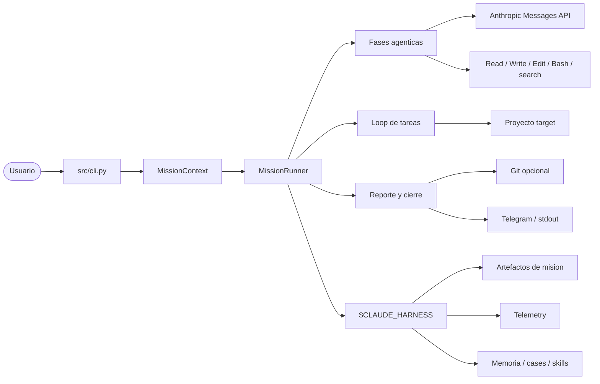
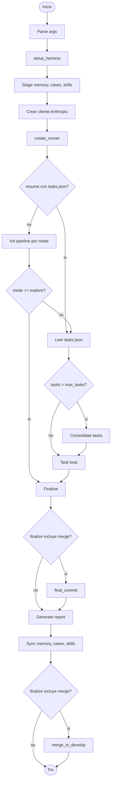
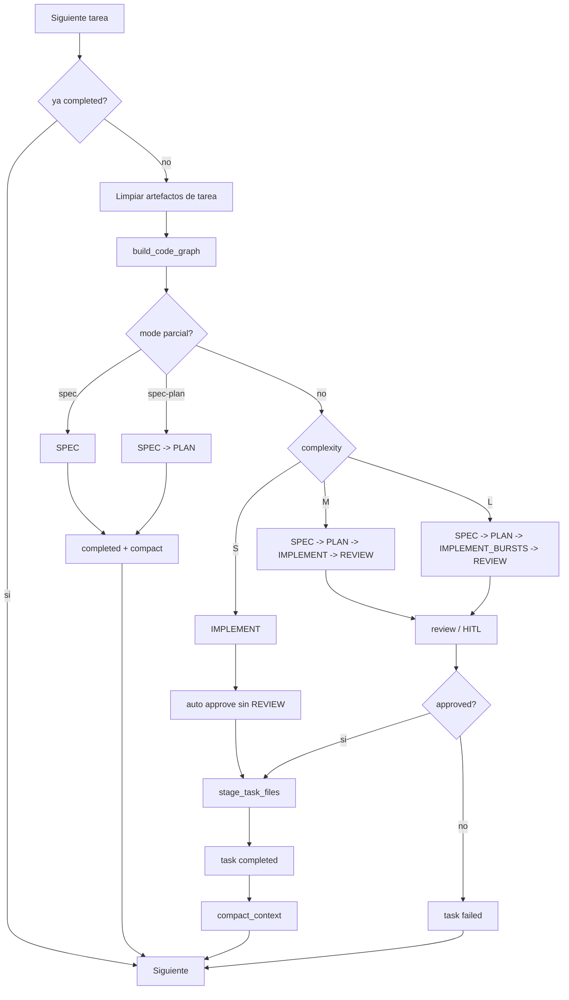
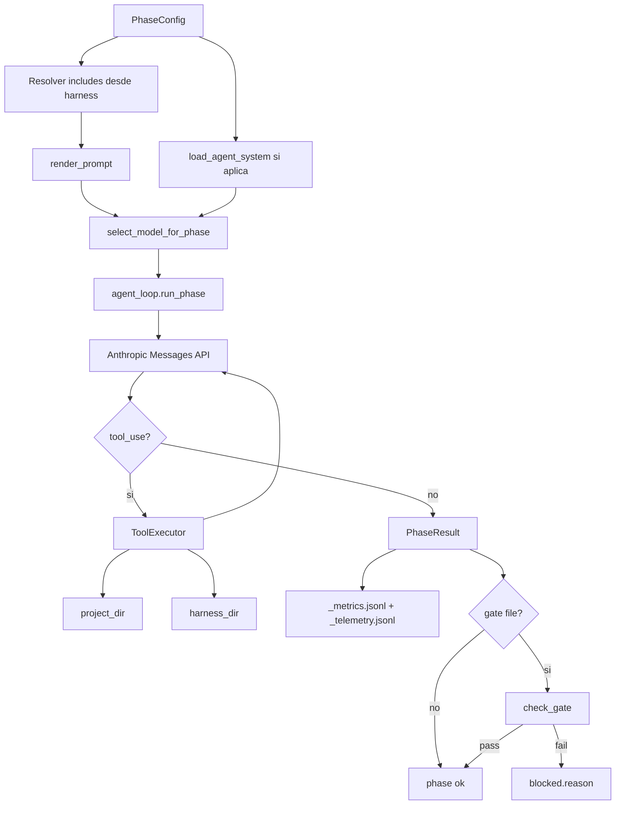
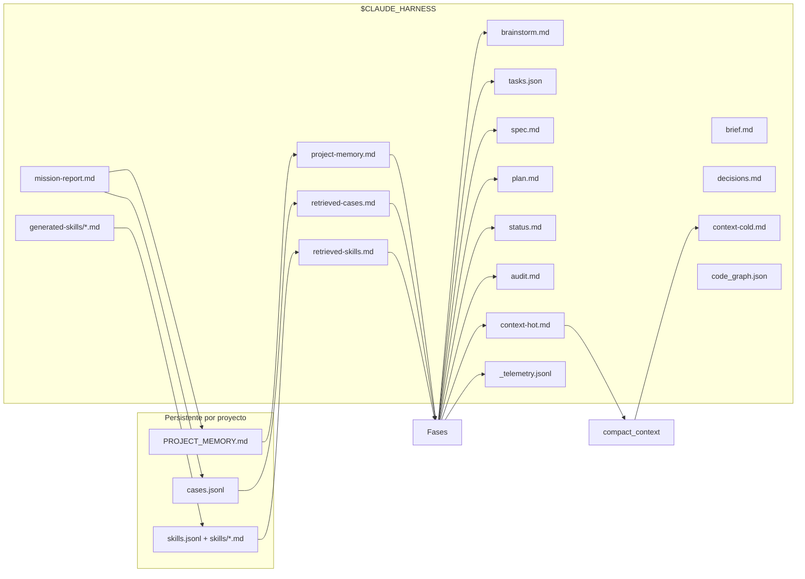
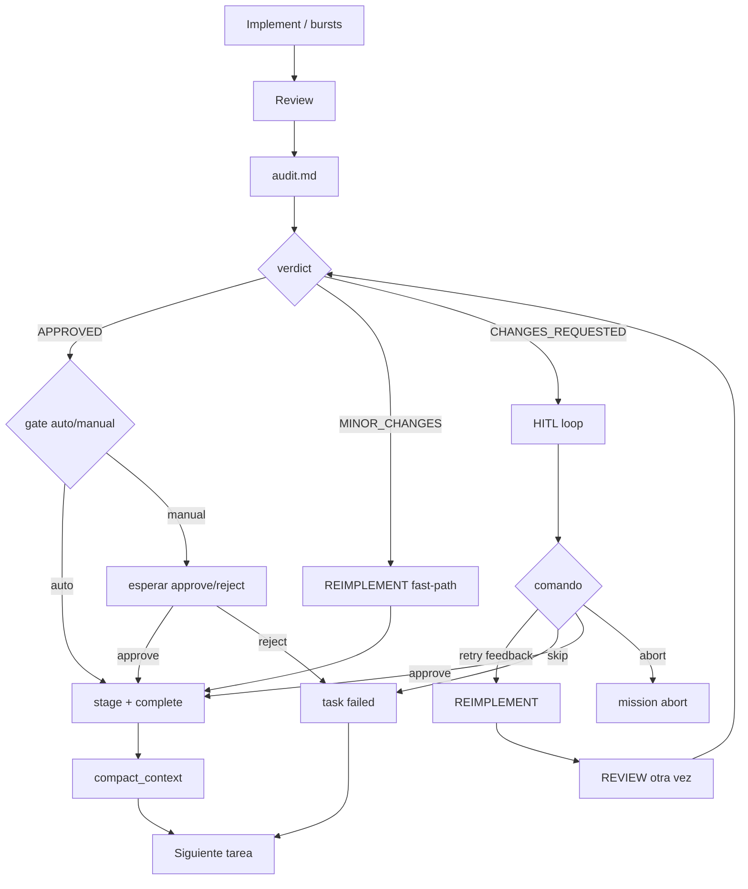
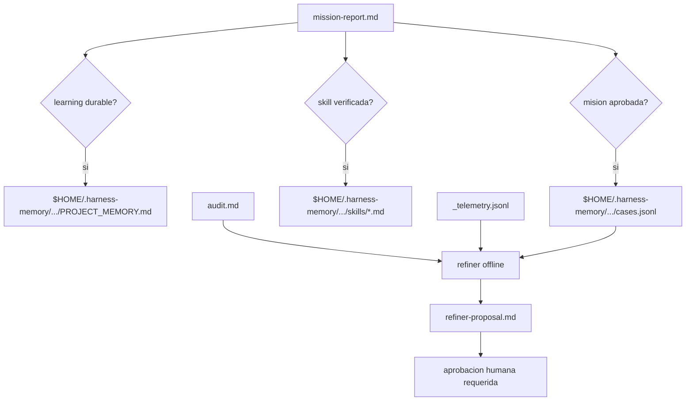
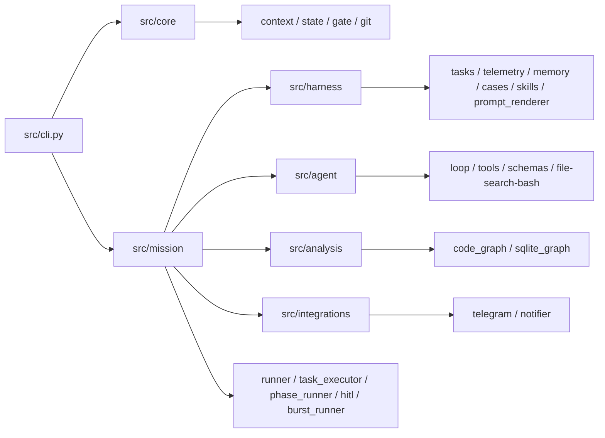

# Harness - mapas de arquitectura y flujo

Este documento es un mapa de lectura progresiva. Empieza por los diagramas de
alto nivel y baja solo cuando necesites entender un subsistema concreto.

Fuentes vivas principales:

- Entry point: `src/cli.py`.
- Orquestacion: `src/mission/runner.py`, `src/mission/task_executor.py`.
- Configuracion de fases y modos: `src/core/context.py`.
- Routing de modelos: `src/core/model_policy.py`.
- Runtime agentico: `src/mission/phase_runner.py`, `src/agent/loop.py`, `src/agent/tools.py`.
- Estado y memoria del harness: `src/harness/*`.

---

## Nivel 0 - Modelo mental

El harness no es un unico agente. Es un sistema de control alrededor de un LLM:
prepara contexto, decide rutas, ejecuta fases con herramientas, valida artefactos,
recupera fallos, registra trazas y conserva aprendizaje reutilizable.

---

## Nivel 1 - Etapas de una mision

Todas las misiones se organizan como `setup -> init -> task loop -> finalize`.
El modo (`--mode`) decide que fases entran en cada bloque.

### Modos de mision

| Mode | Init pipeline | Task pipeline | Finalize | Uso |
|---|---|---|---|---|
| `full` | `research -> compact -> grill? -> structure` | por complejidad S/M/L | `report + merge` | Ruta completa por defecto |
| `focused` | `research -> structure` | por complejidad S/M/L | `report + merge` | Menos conversacion inicial |
| `hotfix` | ninguno | por complejidad S/M/L | `report + merge` | Reusar `tasks.json` existente |
| `explore` | `research` | ninguno | `report` | Solo investigacion |
| `spec` | `research -> grill? -> structure` | `spec` | `report` | Partial harness spec-only |
| `spec-plan` | `research -> grill? -> structure` | `spec -> plan` | `report` | Partial harness spec+plan |

`grill?` se omite con `--no-grill`.
`spec-plan` es el nombre canonico del partial harness que llega hasta `plan.md`;
no existe modo `plan` ni flag `--plan-only`.

---

## Nivel 2 - Pipeline por tarea

`TaskExecutor` borra artefactos stale, reconstruye el grafo de codigo, elige
pipeline, ejecuta fases, registra telemetry y marca estado en `tasks.json`.

### Routing S/M/L

| Complexity | Pipeline | Coste | Riesgo cubierto |
|---|---|---:|---|
| `S` | `implement` | bajo | cambios pequenos y acotados |
| `M` | `spec -> plan -> implement -> review` | medio | flujo normal con reviewer |
| `L` | `spec -> plan -> implement_bursts -> review` | alto | tareas amplias o con mucho riesgo |

Los modos parciales ignoran S/M/L: `spec` fuerza `SPEC`; `spec-plan` fuerza
`SPEC -> PLAN`.

---

## Nivel 3 - Ejecucion de una fase

Cada fase es un `PhaseConfig` en `PHASE_REGISTRY`: agente, prompt, gate,
herramientas, includes, timeout y `max_turns`.

### Capas del runtime agentico

| Capa | Modulo | Responsabilidad |
|---|---|---|
| Prompting | `src/harness/prompt_renderer.py` | Expande templates, includes y footer de workspace |
| Model routing | `src/core/model_policy.py` | Elige modelo por fase, complejidad y overrides de entorno |
| Phase control | `src/mission/phase_runner.py` | Ejecuta fase, valida gate, captura errores |
| Agent loop | `src/agent/loop.py` | Conversacion con Anthropic, retries, timeout, tokens |
| Tool dispatch | `src/agent/tools.py` | Enruta herramientas al handler real |
| Tool schema | `src/agent/tool_schema.py` | Define herramientas disponibles por nombre |
| File/search/bash tools | `src/agent/*_tools.py` | Operaciones sobre proyecto y harness |

### Routing de modelos

El harness no usa un unico modelo para todo. Antes de cada llamada a Anthropic,
`select_model_for_phase()` decide un tier:

| Tier | Modelo por defecto | Uso |
|---|---|---|
| `cheap` | `claude-haiku-4-5` | compactacion, consolidacion, reportes |
| `default` | `claude-sonnet-4-6` | research normal, structure, spec, plan, implement |
| `deep` | `claude-opus-4-7` | grill, review, reimplement, tareas `L`, explore research |

Overrides de entorno:

| Variable | Efecto |
|---|---|
| `CLAUDE_HARNESS_MODEL_CHEAP` | cambia el modelo del tier cheap |
| `CLAUDE_HARNESS_MODEL_DEFAULT` | cambia el modelo del tier default |
| `CLAUDE_HARNESS_MODEL_DEEP` | cambia el modelo del tier deep |
| `CLAUDE_HARNESS_MODEL_FORCE` | fuerza un unico modelo para todas las fases |

`PhaseResult`, `_metrics.jsonl` y `_telemetry.jsonl` registran el modelo usado
por fase. La telemetria calcula `estimated_usd` cuando el modelo esta en la
tabla local de precios; si no, marca `missing_component=model_pricing`.

---

## Nivel 4 - Artefactos y memoria

`$CLAUDE_HARNESS` es el workspace efimero de la mision. El proyecto target solo
recibe cambios de codigo cuando una tarea se stagea/commitea.

### Artefactos principales

| Artefacto | Ciclo de vida | Productor |
|---|---|---|
| `brainstorm.md` | por mision | researcher |
| `brief.md` | opcional, por mision | griller |
| `tasks.json` | fuente de verdad de tareas | structurer + task updater |
| `spec.md` | por tarea, overwrite | specifier |
| `plan.md` | por tarea, overwrite | planner |
| `decisions.md` | por tarea, overwrite o placeholder | planner / runner |
| `status.md` | por tarea | implementer |
| `audit.md` | por tarea | reviewer |
| `context-hot.md` | capa activa | agentes |
| `context-cold.md` | capa historica compactada | compact phase |
| `_telemetry.jsonl` | append-only | runner / phase logger / HITL |
| `mission-report.md` | final | report phase |

---

## Nivel 5 - Review, HITL y recuperacion

El reviewer no edita codigo. Produce `audit.md`; `HitlReviewer` decide si se
stagea, se reimplementa, se pide input humano o se marca fallo.

Telemetry registra `waiting_approval`, `approve`, `reject`, `retry`, `skip`,
`force_approve`, `abort` y `auto_reimplement`.

---

## Nivel 6 - Aprendizaje post-mision

El harness conserva aprendizaje fuera del workspace efimero, pero no aplica
parches automaticamente a prompts/agentes.

| Subsistema | Entrada | Salida | Nota |
|---|---|---|---|
| Project memory | reporte y artefactos | `PROJECT_MEMORY.md` | Convenciones duraderas del repo |
| Mission case base | misiones aprobadas | `cases.jsonl` | Retrieval lexical top-k |
| Skill library | skills `status: verified` | `skills/*.md` + index | Procedimientos reutilizables |
| Refiner | fallos recurrentes | `refiner-proposal.md` | `auto_apply: false` |

---

## Nivel 7 - Mapa de modulos

### Responsabilidades por carpeta

| Carpeta | Responsabilidad |
|---|---|
| `src/core` | Tipos y servicios base: contexto, gates, estado, git, notificacion |
| `src/mission` | Orquestacion de mision, tarea, fases, HITL y reporting |
| `src/harness` | Artefactos, memoria persistente, telemetry, prompt rendering |
| `src/agent` | Loop LLM y herramientas ejecutables |
| `src/analysis` | Grafo de codigo y vistas SQLite |
| `src/integrations` | Telegram, notificaciones y comandos externos |
| `agents/` | Instrucciones de sistema por rol |
| `prompts/` | Templates de fase |
| `commands/` | Comandos manuales fuera del pipeline automatico |

---

## Invariantes utiles

- `tasks.json` es la fuente de verdad de tareas y estados.
- El reviewer es read-only sobre codigo; solo escribe `audit.md`.
- Los modos parciales (`spec`, `spec-plan`) no implementan, no revisan, no stagean y no mergean.
- `full`, `focused` y `hotfix` pueden hacer `final_commit` y `merge_to_develop`.
- `explore` no entra en task loop.
- `PhaseRunner` valida gates despues de cada fase con gate file.
- `_telemetry.jsonl` registra fases, coste/token, tareas e intervenciones HITL.
- `project-memory.md`, `retrieved-cases.md` y `retrieved-skills.md` se inyectan en fases agenticas.
- `generated-skills/` solo promociona skills con `status: verified`.
- El refiner propone cambios offline y requiere aprobacion humana; no modifica prompts/agentes/codigo por si mismo.
